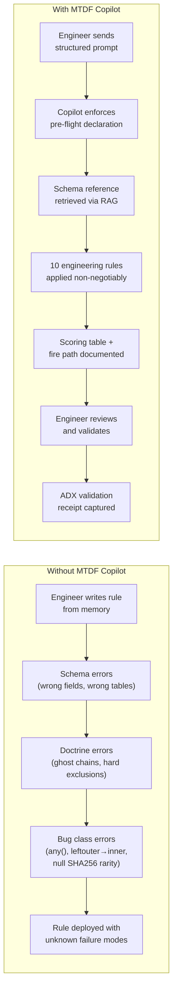
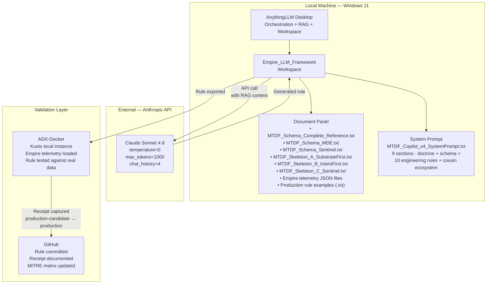
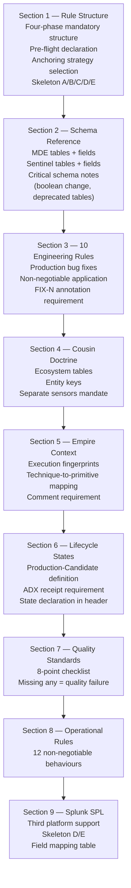
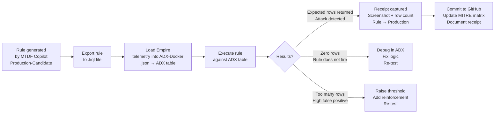
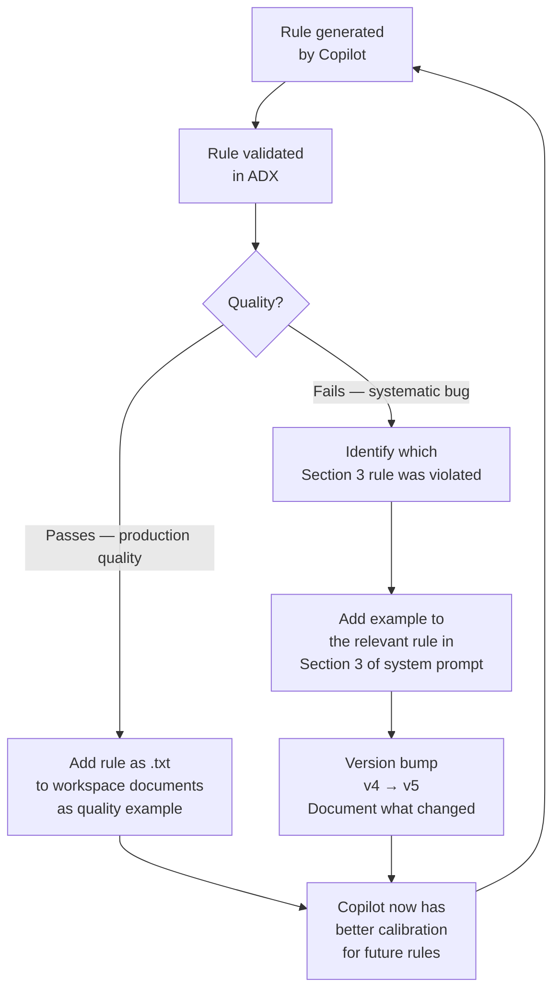
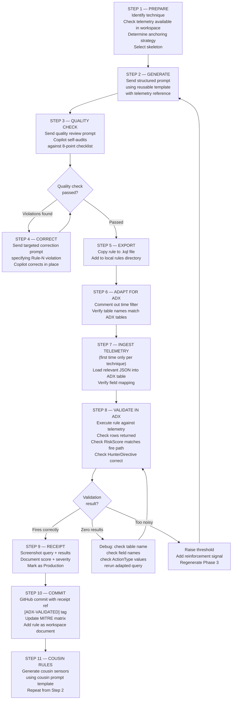

# MTDF AI Copilot — R&D Master Document
### Agentic Detection Engineering Pipeline: Architecture, Implementation & Operational Guide

**Author:** Ala Dabat | 2026  
**Repository:** [azdabat/Empire-LLM-Framework](#) *(link pending)*  
**Framework:** [Minimum Truth Detection Framework](https://github.com/azdabat/Minimum-Truth-Detection-Framework-ADX-Validated-Composite-Rules)  
**License:** [CC BY-NC-SA 4.0](https://creativecommons.org/licenses/by-nc-sa/4.0/legalcode)

---

> *"The Copilot does not replace the detection engineer.*  
> *It accelerates them — enforcing doctrine, preventing implementation bugs,*  
> *and generating schema-precise rule scaffolds that the engineer validates,*  
> *calibrates, and commits."*

---

## Table of Contents

- [Part I — The Problem This Solves](#part-i--the-problem-this-solves)
- [Part II — Architecture](#part-ii--architecture)
- [Part III — System Prompt Design (v4)](#part-iii--system-prompt-design-v4)
- [Part IV — Workspace Configuration](#part-iv--workspace-configuration)
- [Part V — The Prompt Engineering Playbook](#part-v--the-prompt-engineering-playbook)
- [Part VI — Failure Modes & Correction Prompts](#part-vi--failure-modes--correction-prompts)
- [Part VII — Rule Validation: ADX-Docker vs AnythingLLM](#part-vii--rule-validation-adx-docker-vs-anythinglllm)
- [Part VIII — ADX-Docker Validation: Step-by-Step](#part-viii--adx-docker-validation-step-by-step)
- [Part IX — Incremental Fine-Tuning Over Time](#part-ix--incremental-fine-tuning-over-time)
- [Part X — The Full Rule Generation Workflow](#part-x--the-full-rule-generation-workflow)

---

## Part I — The Problem This Solves

### Why Detection Engineering Is Hard at Scale

Production-grade KQL composite rules require simultaneous mastery of five distinct domains:

1. **Schema precision** — exact field names, ActionType values, boolean semantics per table
2. **KQL engine behaviour** — determinism rules, join semantics, aggregation edge cases
3. **Detection doctrine** — minimum truth anchoring, reinforcement vs dependency, scoring architecture
4. **Adversary tradecraft** — which technique, which execution path, which telemetry surface
5. **Operational constraints** — noise suppression, prevalence baselining, SOC usability

A detection engineer operating without tooling must hold all five domains in working memory simultaneously. The result is predictable: rules that are logically correct but technically flawed, or technically correct but doctrinally wrong. The five production bug classes documented in the MTDF engineering errors reference were all found in rules written by an experienced engineer without automated doctrine enforcement.

### What the MTDF Copilot Does

The Copilot is not a code generator. It is a **doctrine-enforcement engine** that:

- Forces pre-flight declaration before any KQL is written
- Applies all ten production engineering rules non-negotiably
- Selects the correct anchoring strategy per technique
- Uses the correct MDE/Sentinel table per telemetry surface
- Produces structured output (scoring table, minimum fire path, Hunter Directive, cousin identification) that cannot be skipped
- References Empire telemetry documents to ground rule generation in real attack data



---

## Part II — Architecture

### Stack Overview



### Component Roles

| Component | Role | Why This Choice |
|-----------|------|----------------|
| AnythingLLM | Orchestration, workspace isolation, RAG | Local deployment — Empire telemetry never leaves machine |
| Claude Sonnet 4.6 | LLM engine | Superior instruction following at temperature=0 |
| temperature=0 | Deterministic output | Detection rules must be reproducible, not creative |
| chat_history=4 | Short-term context | Enough for follow-up corrections, prevents context poisoning |
| Chat mode (not Agent) | Direct generation | Agent mode introduces tool-calling overhead and instability |
| RAG documents | Schema + skeleton reference | Keeps system prompt lean — schema retrieved on demand |
| Empire telemetry JSON | Real attack signal grounding | Rules generated against actual attack data, not theory |
| ADX-Docker | Validation environment | Isolated, repeatable, receipt-capable |

### Why Not Ollama / Local LLM?

The initial architecture used Ollama with `qwen2.5-coder:7b`. This was abandoned after systematic failures:

| Issue | Impact | Resolution |
|-------|--------|-----------|
| Model unloading mid-generation | Incomplete rules with no error | Switched to Claude API |
| 4b parameter models forget instructions | Doctrine ignored after 2-3 exchanges | Claude Sonnet 4.6 |
| Inconsistent schema recall | Wrong field names, hallucinated tables | Claude API with RAG |
| Context window exhaustion on long rules | Truncated output, missing phases | claude_history=4 limit |

**Key decision:** Claude Sonnet 4.6 via Anthropic API at temperature=0 is the only configuration that reliably enforces all nine system prompt sections simultaneously across a full 4-phase rule generation.

---

## Part III — System Prompt Design (v4)

### Architecture of the v4 System Prompt

The v4 system prompt has nine sections. Each section solves a specific failure mode observed in earlier versions.



### The Ten Engineering Rules — Why Each Exists

These rules were derived from systematic review of 11 composite rules that had passed initial review but contained production bugs:

| Rule | Bug Fixed | Consequence If Missed |
|------|-----------|----------------------|
| 1 — arg_max over any() | Non-deterministic summarise | Cmd field contradicts flag field in same output row |
| 2 — make_set_if | Empty strings in analyst sets | Polluted output sets with "" values |
| 3 — substring length guard | Throws on short strings | Rule crashes on short command lines |
| 4 — Prevalence window separation | Baseline poisoned by attack data | Rarity flag suppressed on active intrusion |
| 5 — Null SHA256 guard | ubiquitous binaries scored as rare | Every powershell.exe alert gets free rarity boost |
| 6 — leftouter → inner prevention | Reinforcement becomes mandatory | Real attacks with no reinforcement silently dropped |
| 7 — Explicit int comparison | Inconsistent boolean truthiness | Scoring arithmetic fails on some engine versions |
| 8 — toint() for boolean flags | Type inconsistency in scoring | Arithmetic produces unexpected results |
| 9 — Score floors for critical signals | Trust discounts bury critical findings | Two critical permissions score below threshold |
| 10 — Score floor at zero | Negative scores in output | Analyst confusion + downstream SIEM corruption |

### Skeletons — The Template System

Five skeleton templates are stored as workspace documents and retrieved via RAG:

| Skeleton | Strategy | Platform | When to Use |
|----------|----------|----------|-------------|
| A | Substrate-First | MDE Advanced Hunting | WMI fileless, BYOVD, named pipes, driver loads |
| B | Intent-First | MDE Advanced Hunting | PowerShell, LOLBins, certutil, bitsadmin, OAuth |
| C | Substrate-First | Microsoft Sentinel | When MDE telemetry unavailable, Sysmon source |
| D | Intent-First | Splunk SPL | Splunk ES environments |
| E | Substrate-First | Splunk SPL | Splunk ES environments |

---

## Part IV — Workspace Configuration

### Current Empire_LLM_Framework Workspace Setup

Based on the workspace screenshot, the current configuration is:

```
Workspace: Empire_LLM_Framework
Model:     Claude Sonnet 4.6
Chat mode: Chat (NOT Agent, NOT Query)
History:   4

System Prompt: MTDF_Copilot_v4_SystemPrompt.txt (9 sections)

Documents (7):
├── cmd_bitsadmin_download_psh_script_2020-10-...189.json  ← Empire telemetry
├── MTDF_Schema_Complete_Reference.txt                      ← Full schema reference
├── MTDF_Schema_MDE.txt                                     ← MDE-specific schema
├── MTDF_Schema_Sentinel.txt                                ← Sentinel schema
├── MTDF_Skeleton_A_SubstrateFirst.txt                      ← Skeleton template
├── MTDF_Skeleton_B_IntentFirst.txt                         ← Skeleton template
└── MTDF_Skeleton_C_Sentinel.txt                            ← Skeleton template
```

### Documents Still to Add

For complete coverage, add these to the workspace:

```
Still needed:
├── 01_lsass_process_access.json          ← Primary LSASS signal (from telemetry split)
├── 02_process_create_rundll32.json       ← rundll32 process creation signal
├── 04_file_create.json                   ← File staging signal
├── 06_network_events.json                ← C2 network signal
├── LSASS_Credential_Theft_Master.txt     ← Existing production rule as quality example
└── SMB_Service_Execution.txt             ← Existing production rule as quality example
```

**Why production rules as documents:** The Copilot learns output quality calibration from examples. Your validated rules set the standard that generated rules must meet.

### Chat Mode vs Agent vs Query

| Mode | Use | Avoid |
|------|-----|-------|
| **Chat** ✅ | Rule generation — this is what you want | — |
| Agent ❌ | Tool use, web search | Introduces instability, ignores system prompt sections |
| Query ❌ | Simple document Q&A only | Too restrictive for structured generation |

---

## Part V — The Prompt Engineering Playbook

### The Anatomy of a Perfect Generation Prompt

Every rule generation prompt must contain these five elements:

```
ELEMENT 1: Technique + MITRE ID
ELEMENT 2: Anchoring strategy (or ask Copilot to declare)
ELEMENT 3: Target environment (MDE / Sentinel / Splunk)
ELEMENT 4: Telemetry reference (which document in workspace)
ELEMENT 5: Specific constraint (fileless only / named export / ordinal form)
```

### Reusable Prompt Templates

Copy, fill in the bracketed values, and send.

---

#### TEMPLATE A — Intent-First MDE Rule

```
Generate a production-candidate composite rule for [T####.###] 
[technique name and brief description].

Intent-First. Skeleton B. MDE Advanced Hunting.

Empire telemetry reference: [filename from workspace] contains 
the primary signal — [describe what the signal shows in 1 sentence].

Cover these execution paths:
- [path 1 — e.g. named export form]
- [path 2 — e.g. ordinal form / alternate invocation]

Minimum truth: [state the irreducible anchor explicitly].

Include:
- Pre-flight declaration with all five fields
- Inline doctrine commentary on every phase
- Scoring decision table (Signal | Points | Rationale)
- Minimum fire path arithmetic
- Three cousin sensors needed
- All ten engineering rules from Section 3 applied
```

---

#### TEMPLATE B — Substrate-First MDE Rule

```
Generate a production-candidate composite rule for [T####.###]
[technique name].

Substrate-First. Skeleton A. MDE Advanced Hunting.

This is the [fileless / kernel-level / no-child-process] variant.
There is NO child process. NO command-line argument visible.
The substrate IS the signal.

Minimum truth: [state the substrate existence condition explicitly].
Table: [specify the correct table — DeviceImageLoadEvents / DeviceEvents / etc.]
Do NOT use DeviceProcessEvents for this technique.

Empire telemetry reference: [filename if applicable].

Include:
- Pre-flight declaration with all five fields
- Inline doctrine commentary on every phase  
- Scoring decision table
- Minimum fire path arithmetic
- Three cousin sensors needed
- All ten engineering rules from Section 3 applied
```

---

#### TEMPLATE C — Sentinel Rule (KQL Analytics)

```
Generate a production-candidate composite rule for [T####.###]
[technique name].

[Substrate-First / Intent-First]. Skeleton C. Microsoft Sentinel.

Primary table: [SecurityEvent EID #### / WindowsEvent Sysmon EID ## / AuditLogs].

Note: ParentCommandLine is NOT available in SecurityEvent EID 4688.
Use Sysmon WindowsEvent path for parent command line context.
Pre-filter EventData string before parse_xml() to minimise cost.

Minimum truth: [state the anchor].

Include:
- Pre-flight declaration
- Scoring decision table
- Minimum fire path arithmetic
- Cousin identification
- All ten engineering rules applied
```

---

#### TEMPLATE D — Multi-Platform (All Three)

```
Generate production-candidate composite rules for [T####.###]
[technique name] across all three platforms.

Label each variant clearly: MDE VARIANT / SENTINEL VARIANT / SPLUNK VARIANT.

Anchoring: [Substrate-First / Intent-First] throughout.
Minimum truth is identical across all three — only syntax changes.

Minimum truth: [state the anchor].

For each variant include:
- Correct table for that platform
- Platform-specific field names (use the schema reference)
- Scoring preserving the same base and thresholds
- Hunter Directive adapted for analyst workflow on that platform

Apply all ten engineering rules throughout.
```

---

#### TEMPLATE E — Full Empire Kill Chain (Master Prompt)

Send this to generate the complete Empire C2 detection suite in a single session:

```
Generate production-candidate composite rules for the complete 
Empire C2 kill chain. Each rule is a separate independent sensor.
Use MDE Advanced Hunting throughout. Apply all ten engineering 
rules from Section 3 to every rule without exception.

Generate each rule in sequence. Before each rule, state the 
pre-flight declaration. After each rule, state three cousin 
sensors needed.

RULE 1: T1059.001 — PowerShell Empire Stager
Intent-First · Skeleton B · DeviceProcessEvents
Signal: -NoP -sta -NonI -W Hidden -Enc [base64]
Cover: encoded command · IEX download cradle · AMSI bypass · VirtualAlloc

RULE 2: T1071.001 — Empire HTTPS C2 Beacon
Intent-First · Skeleton B · DeviceNetworkEvents
Signal: low-volume HTTPS to first-seen domain · jitter pattern
Cover: /admin/get.php and /news.php URIs · rare ASN · beacon interval

RULE 3: T1547.001 — Registry Run Key Persistence
Intent-First · Skeleton B · DeviceRegistryEvents
Signal: RegistryValueSet under \Run with PowerShell payload
Cover: HKCU\Run · HKLM\Run · RunOnce variants

RULE 4: T1053.005 — TaskCache Silent Persistence
Substrate-First · Skeleton A · DeviceRegistryEvents
Signal: TaskCache write without schtasks.exe
Cover: direct API/COM task creation · no CLI artefact

RULE 5: T1197 — BITSAdmin Download + Execution
Intent-First · Skeleton B · DeviceProcessEvents
Telemetry: cmd_bitsadmin_download_psh_script document
Cover: /transfer flag · /create /addfile /resume sequence

RULE 6: T1003.001 — LSASS Dump via comsvcs MiniDump
Intent-First · Skeleton B · DeviceEvents
Cover: named export (MiniDump) · ordinal form (#24)

RULE 7: T1021.002 — SMB Lateral Movement
Intent-First · Skeleton B · DeviceProcessEvents
Signal: services.exe spawning uncommon child binary

RULE 8: T1021.003 — WMI Remote Execution
Substrate-First · Skeleton A · DeviceProcessEvents
Signal: WmiPrvSE.exe spawning cmd.exe or powershell.exe

RULE 9: T1546.003 — WMI Fileless Persistence
Substrate-First · Skeleton A · DeviceImageLoadEvents
Signal: scrcons.exe loading vbscript.dll / jscript.dll / scrobj.dll
NOTE: NO child process. NO cmdline. DeviceImageLoadEvents ONLY.
```

---

### The Follow-Up Prompt — Quality Review

Send this immediately after every rule generation:

```
Review the rule you just generated against the MTDF quality 
standards checklist from Section 7. Check each item explicitly:

1. Pre-flight — all five fields present and correct?
2. Correct table for this technique?
3. Phase 1 is minimum truth only — no joins at this phase?
4. Phase 2 uses InitiatingProcess* native fields — no raw joins?
5. All ten engineering rules applied:
   □ arg_max not any()
   □ make_set_if not make_set(iff(...))
   □ substring(str, 0, min(strlen(str), N))
   □ prevalence window ends before detection window starts
   □ isnotempty(SHA256) guards all rarity conditions
   □ leftouter join — extend IsMatch before filtering
   □ iff(flag == 1, ...) not iff(flag, ...)
   □ toint() wraps all boolean signal flags
   □ score floor for critical signals
   □ iif(RiskScore < 0, 0, RiskScore) at end of scoring
6. Scoring decision table — Signal | Points | Rationale present?
7. Minimum fire path arithmetic documented?
8. HunterDirective defined BEFORE project statement?
9. Three cousin rules identified?
10. Lifecycle state in rule header?

Flag every violation. Correct all violations in place.
```

---

### The Correction Prompt — Targeted Fix

When you identify a specific issue without wanting to regenerate:

```
In the rule you just generated, correct the following:

[Describe the specific issue]

Apply [RULE-N] from Section 3.
Do not regenerate the entire rule — correct only the affected section 
and show the before/after change.
```

---

### The Cousin Rule Prompt

After generating a primary rule, immediately request the most important cousin:

```
Generate the cousin rule for [primary technique].

The primary rule covers [primary execution path].
This cousin covers [adjacent execution path] — same adversary intent, 
different substrate, different noise domain.

[Substrate-First / Intent-First]. Skeleton [X]. 
[Table name — different from primary rule].

The two rules must NOT share truth anchors.
They correlate at the incident layer via entity key: DeviceName.
```

---

## Part VI — Failure Modes & Correction Prompts

### The Seven Common Failure Modes

These are the failure patterns to actively watch for in every generated rule.

---

#### Failure Mode 1 — Wrong Table Selection

**What it looks like:**
```kql
// WRONG: Using DeviceProcessEvents for WMI fileless
DeviceProcessEvents
| where InitiatingProcessFileName =~ "scrcons.exe"
// There is no child process in the fileless variant
// This table will never show the attack
```

**Why it happens:** The model defaults to DeviceProcessEvents as the most familiar MDE table. Without the explicit constraint "NO child process", it generates the noisier non-fileless variant.

**Correction prompt:**
```
The rule you generated uses DeviceProcessEvents but this technique 
has NO child process in the fileless variant. The payload executes 
as a DLL loaded into scrcons.exe memory. Switch to 
DeviceImageLoadEvents and anchor on scrcons.exe loading 
vbscript.dll / jscript.dll / scrobj.dll. Regenerate Phase 1 only.
```

---

#### Failure Mode 2 — Ghost Chain (Mandatory Join)

**What it looks like:**
```kql
// WRONG: join kind=inner makes reinforcement mandatory
SideloadEvents
| join kind=inner (DriverDrops) on DeviceId
// If no driver drop exists, the sideload event is silently dropped
// Real attacks may have the sideload without yet staging the driver
```

**Why it happens:** The model uses `inner` join when trying to correlate events, not understanding that this converts reinforcement into a hard dependency.

**Correction prompt:**
```
The join kind=inner in this rule converts reinforcement into a 
mandatory dependency — creating a ghost chain. Any event without 
a matching reinforcement artefact is silently dropped. Apply 
Rule 6: change to join kind=leftouter, extend IsMatch after the 
join, use make_set_if(DriverFile, IsMatch == 1) for aggregation. 
Correct Phase 2 only.
```

---

#### Failure Mode 3 — any() Non-Determinism

**What it looks like:**
```kql
// WRONG: Multiple any() calls in same summarise
| summarize
    Cmd          = any(ProcessCommandLine),
    HasEncoded   = any(IsEncodedPayload),
    HasAMSI      = any(IsAMSIBypass)
  by DeviceId
// Cmd may come from row A, HasEncoded from row B
// The flag may not reflect the command line shown
```

**Why it happens:** The model uses `any()` as a pass-through convenience, not recognising the non-determinism risk.

**Correction prompt:**
```
The summarise block uses multiple any() calls — apply Rule 1. 
Replace all any() pass-through columns with a single 
arg_max(Timestamp, *) which locks all columns to the most 
recent consistent row. Remove all individual any() references.
```

---

#### Failure Mode 4 — Hard Exclusion Instead of Soft Score

**What it looks like:**
```kql
// WRONG: Hard exclusion creates blind spot
| where InitiatingProcessFileName != "ccmexec.exe"
// If attacker runs payload from ccmexec.exe context
// the detection is completely blind
```

**Why it happens:** The model has seen hard exclusion patterns in public KQL examples and replicates them without understanding the doctrine.

**Correction prompt:**
```
The where clause with != creates a hard exclusion and a blind spot. 
Apply MTDF doctrine: replace with a soft down-score penalty.
Remove the where filter and add:
| extend RiskScore = RiskScore - iff(
    InitiatingProcessFileName in~ ("ccmexec.exe", "trustedinstaller.exe"),
    20, 0)
This preserves telemetry visibility while reducing urgency.
```

---

#### Failure Mode 5 — HunterDirective After project

**What it looks like:**
```kql
// WRONG: HunterDirective defined after project
| project Timestamp, DeviceName, RiskScore
| extend HunterDirective = strcat(...)
// HunterDirective is appended but not in the explicit project list
// Downstream project statements will silently drop it
```

**Correction prompt:**
```
The HunterDirective extend is defined after the project statement. 
Apply the additional field rule from Section 3: move the 
HunterDirective extend to BEFORE the project statement, and 
add HunterDirective explicitly to the project column list.
```

---

#### Failure Mode 6 — Null SHA256 Rarity

**What it looks like:**
```kql
// WRONG: Rarity fires on null SHA256
| extend IsRare = toint(coalesce(DeviceCount, 0) <= 2)
// cmd.exe has null SHA256 → DeviceCount = 0 → IsRare = 1
// Every cmd.exe alert gets a free 10-point rarity boost
```

**Correction prompt:**
```
The rarity condition fires on null SHA256. Apply Rule 5:
Change to:
| extend IsRare = toint(
    isnotempty(InitiatingProcessSHA256) and 
    coalesce(DeviceCount, 0) <= 2
)
```

---

#### Failure Mode 7 — Prevalence Window Overlap

**What it looks like:**
```kql
// WRONG: Prevalence includes detection window
let OrgPrevalence =
    DeviceFileEvents
    | where Timestamp >= ago(30d)  // includes today
    | summarize DeviceCount = dcount(DeviceId) by SHA256;
```

**Correction prompt:**
```
The prevalence window overlaps the detection window — apply Rule 4.
The baseline must end before the detection window starts:
| where Timestamp >= ago(60d) and Timestamp < ago(7d)
This prevents active attack telemetry from inflating DeviceCount 
and suppressing the rarity flag on an ongoing intrusion.
```

---

### Failure Mode Quick Reference

| Symptom Observed | Failure Mode | Rule Violated | Correction Trigger |
|-----------------|-------------|--------------|-------------------|
| Rule misses fileless variant | Wrong table | Doctrine | "NO child process — switch to DeviceImageLoadEvents" |
| Real attacks dropped | Ghost chain | Rule 6 | "Change inner to leftouter, extend IsMatch" |
| Flag contradicts command | any() | Rule 1 | "Replace any() with arg_max(Timestamp, *)" |
| SCCM creates blind spot | Hard exclusion | Doctrine | "Soft down-score penalty, not where exclusion" |
| HunterDirective missing | After project | Additional rules | "Move extend before project" |
| Benign binaries scored rare | Null SHA256 | Rule 5 | "Add isnotempty(SHA256) guard" |
| Rarity suppresses active attack | Window overlap | Rule 4 | "Prevalence window < ago(detection_window)" |
| Negative scores in output | No floor | Rule 10 | "Add iif(RiskScore < 0, 0, RiskScore)" |

---

## Part VII — Rule Validation: ADX-Docker vs AnythingLLM

### Can You Test Rules Against Empire Telemetry Inside AnythingLLM?

**Short answer:** No. AnythingLLM is a RAG + conversation system — it processes documents as text and uses them for context in generation. It does not execute KQL queries. The telemetry JSON files in your workspace are reference documents that inform rule generation. They cannot be queried.

**What AnythingLLM can do with telemetry:**
- Reference telemetry field names and values when generating rules
- Use telemetry examples to select correct signal patterns
- Verify that generated rules target the correct fields observed in the telemetry

**What AnythingLLM cannot do:**
- Execute KQL against the telemetry data
- Return query results
- Confirm whether a rule would fire on the telemetry
- Measure false positive rate

### The Only Way to Test — ADX-Docker

Azure Data Explorer running locally in Docker is the correct validation environment. It executes real KQL against real telemetry and produces results. A rule that returns expected rows against Empire telemetry in ADX gets promoted from `Production-Candidate` to `Production`.



---

## Part VIII — ADX-Docker Validation: Step-by-Step

### Prerequisites

- Docker Desktop installed and running on Windows 11
- Azure Data Explorer free cluster OR ADX Docker image
- Empire telemetry JSON files (the split files from your workspace)
- Generated KQL rule from MTDF Copilot

---

### Method A — Azure Data Explorer Free Cluster (Recommended)

This is the simplest path. Microsoft provides a free ADX cluster that accepts JSON data ingestion and runs full KQL.

#### Step 1 — Create Your Free ADX Cluster

1. Go to [https://dataexplorer.azure.com](https://dataexplorer.azure.com)
2. Click **+ Add cluster** → **Create a free cluster**
3. Name your cluster (e.g. `mtdfvalidation`)
4. Click **Create** — takes approximately 2 minutes
5. Once created, click **+ Add database** → name it `empire_telemetry`

#### Step 2 — Create Tables Matching MDE Schema

In the ADX query editor, run these commands to create tables:

```kql
// Create DeviceEvents table for LSASS telemetry
.create table DeviceEvents (
    Timestamp: datetime,
    DeviceId: string,
    DeviceName: string,
    ActionType: string,
    FileName: string,
    FolderPath: string,
    SHA256: string,
    InitiatingProcessFileName: string,
    InitiatingProcessSHA256: string,
    InitiatingProcessCommandLine: string,
    InitiatingProcessAccountName: string,
    AdditionalFields: dynamic
)
```

```kql
// Create DeviceProcessEvents table
.create table DeviceProcessEvents (
    Timestamp: datetime,
    DeviceId: string,
    DeviceName: string,
    ActionType: string,
    FileName: string,
    FolderPath: string,
    SHA256: string,
    ProcessId: long,
    ProcessCommandLine: string,
    AccountName: string,
    AccountDomain: string,
    InitiatingProcessFileName: string,
    InitiatingProcessCommandLine: string,
    InitiatingProcessSHA256: string,
    InitiatingProcessId: long,
    InitiatingProcessSignerType: string,
    InitiatingProcessIntegrityLevel: string,
    InitiatingProcessAccountName: string
)
```

```kql
// Create DeviceNetworkEvents table
.create table DeviceNetworkEvents (
    Timestamp: datetime,
    DeviceId: string,
    DeviceName: string,
    ActionType: string,
    RemoteIP: string,
    RemotePort: int,
    RemoteUrl: string,
    RemoteIPType: string,
    LocalIP: string,
    LocalPort: int,
    Protocol: string,
    InitiatingProcessFileName: string,
    InitiatingProcessSHA256: string,
    InitiatingProcessAccountName: string,
    InitiatingProcessCommandLine: string
)
```

#### Step 3 — Ingest Empire Telemetry JSON Files

For each telemetry file, use the ADX ingestion wizard:

1. In ADX, select your `empire_telemetry` database
2. Click **Ingest data** → **From local file**
3. Select the target table (e.g. `DeviceEvents` for `01_lsass_process_access.json`)
4. Upload the JSON file
5. ADX auto-maps fields — review the mapping and correct any mismatches
6. Click **Start ingestion**
7. Repeat for each telemetry file

**File → Table mapping:**

| Telemetry File | ADX Table |
|----------------|-----------|
| `01_lsass_process_access.json` | `DeviceEvents` |
| `02_process_create_rundll32.json` | `DeviceProcessEvents` |
| `04_file_create.json` | `DeviceFileEvents` |
| `06_network_events.json` | `DeviceNetworkEvents` |
| `cmd_bitsadmin_download_psh_script...json` | `DeviceProcessEvents` |
| `empire_mimikatz_lsadump_patch...json` | `DeviceEvents` |

#### Step 4 — Adapt the Generated Rule for ADX

The generated rules use `ago()` time functions. ADX has all the telemetry as static data, so remove time filters for initial validation:

```kql
// ORIGINAL (production rule with time filter):
DeviceEvents
| where Timestamp > ago(24h)
| where ActionType == "OpenProcessApiCall"
...

// ADX VALIDATION VERSION (remove time filter):
DeviceEvents
// | where Timestamp > ago(24h)  ← comment out for validation
| where ActionType == "OpenProcessApiCall"
...
```

#### Step 5 — Execute and Capture Receipt

1. Paste the adapted rule into the ADX query editor
2. Click **Run**
3. Expected result: rows returned matching the attack telemetry
4. **Capture the receipt:**
   - Screenshot of the query editor showing the rule
   - Screenshot of the results pane showing row count and key fields
   - Note the `RiskScore` and `Severity` values on the returned rows
   - Note the `HunterDirective` field content

#### Step 6 — Validate the Score

Confirm the minimum fire path arithmetic is correct:

```kql
// Add this to your validation query to see score breakdown
| extend ScoreBreakdown = strcat(
    "Base=55",
    " + IsElevated=", tostring(iff(IsElevatedSession==1, 15, 0)),
    " + SuspectPath=", tostring(iff(IsSuspectOutputPath==1, 10, 0)),
    " = ", tostring(RiskScore)
)
```

Expected: The score matches the minimum fire path documented in the pre-flight declaration.

#### Step 7 — Promote to Production

Once the rule fires correctly against Empire telemetry:

1. Update the rule header: `// STATUS: Production (ADX validated YYYY-MM-DD)`
2. Add receipt reference: `// RECEIPT: [screenshot filename or ADX query link]`
3. Commit to GitHub
4. Update the MITRE coverage matrix status for that technique

---

### Method B — ADX Docker (Fully Local)

If you prefer fully local validation with no cloud dependency:

#### Step 1 — Pull the ADX Docker Image

```powershell
# In PowerShell (run as Administrator)
docker pull mcr.microsoft.com/azuredataexplorer/kustainer:latest
```

#### Step 2 — Start the ADX Container

```powershell
docker run -d `
  --name mtdf-adx `
  -p 8080:8080 `
  mcr.microsoft.com/azuredataexplorer/kustainer:latest
```

#### Step 3 — Connect to Local ADX

1. Open [https://dataexplorer.azure.com](https://dataexplorer.azure.com)
2. Click **+ Add cluster**
3. Connection URI: `http://localhost:8080`
4. Click **Add**

#### Step 4 — Follow Steps 2-7 from Method A

The remaining process is identical to Method A once connected.

---

### What a Valid Receipt Looks Like

A production receipt consists of:

```
Receipt: T1003.001_LSASS_MiniDump_ADX_Validation
Date: 2026-01-01
Rule: MDE_T1003001_LSASS_MiniDump_comsvcs_Composite
Telemetry: 01_lsass_process_access.json (6 events)

Results:
- Rows returned: 6
- RiskScore range: 80-95
- Severity: HIGH / CRITICAL
- HunterDirective: correctly identifies MiniDump + ordinal #24
- False positive test: 0 rows on clean baseline telemetry

Status: PROMOTED TO PRODUCTION
```

---

## Part IX — Incremental Fine-Tuning Over Time

### The Improvement Cycle

The MTDF Copilot improves through two mechanisms: system prompt versioning and quality example accumulation.



### System Prompt Versioning

Maintain a version history for the system prompt. Each version should document what changed and why:

| Version | Changes | Trigger |
|---------|---------|---------|
| v1 | Initial prompt — basic structure only | First generation |
| v2 | Added schema reference (Section 2) | Schema hallucination errors |
| v3 | Added 10 engineering rules (Section 3) | Production bug review |
| v4 | Added cousin doctrine, Empire context, lifecycle states, Splunk | Systematic quality review |
| v5 | *(next)* Add validated production rules as inline examples | First batch of ADX receipts |

### Adding Quality Examples to the System Prompt

Once you have five or six ADX-validated rules, add them to Section 7 of the system prompt as calibration examples:

```
## SECTION 7 — QUALITY STANDARDS

[existing checklist]

### CALIBRATION EXAMPLES — VALIDATED PRODUCTION RULES

The following rules have been validated in ADX and represent 
the expected output quality:

EXAMPLE 1 — T1003.001 LSASS (Intent-First, Skeleton B):
[paste rule header + Phase 1 + scoring table only — not full rule]

EXAMPLE 2 — T1546.003 WMI Fileless (Substrate-First, Skeleton A):
[paste rule header + Phase 1 + scoring table only]
```

This gives the model concrete output calibration rather than abstract instructions.

### Adding Production Rules as Workspace Documents

For every ADX-validated rule, save it as a `.txt` file and add to the workspace:

```
Empire_LLM_Framework workspace documents — target state:
├── Schema references (current — 3 files)
├── Skeleton templates (current — 3 files)
├── Empire telemetry signals (current — 1 file, target: 6 files)
└── Production rule examples (target: 10+ files)
    ├── T1003001_LSASS_MiniDump_PRODUCTION.txt
    ├── T1059001_PowerShell_Stager_PRODUCTION.txt
    ├── T1546003_WMI_Fileless_PRODUCTION.txt
    ├── T1197_BITSAdmin_PRODUCTION.txt
    └── ...
```

The RAG system retrieves relevant production examples when generating similar techniques — calibrating output quality progressively.

### Tracking Coverage Progress

After each validated rule, update three places:

1. **MITRE coverage matrix** — change status from `In Progress` to `Validated`
2. **MTDF roadmap HTML** — update the rule card status
3. **GitHub commit message** — include `[ADX-VALIDATED]` tag

---

## Part X — The Full Rule Generation Workflow

### The Complete Process — From Prompt to Production



### Session Management

Each rule generation session should be a **new thread** in AnythingLLM. This prevents:

- Previous rule context contaminating the new rule
- Ghost chain formation across rules
- System prompt dilution over long conversations

```
Best practice:
├── Open new thread for each technique
├── Send one generation prompt
├── Send one quality check prompt
├── Send correction prompts if needed
├── Export rule
├── Close thread
└── Open new thread for next technique
```

### The Copilot Is Not The Validator

The most important operational principle:

> **The Copilot generates Production-Candidate rules.**  
> **ADX-Docker validates them.**  
> **The engineer promotes them.**  
> **GitHub records them.**  
> **The MITRE matrix tracks them.**

The Copilot is not the final authority on rule quality. It enforces doctrine and prevents implementation bugs. But the ground truth is always ADX — does the rule fire against real Empire telemetry? Only a confirmed receipt answers that question.

---

> [!NOTE]
> This document describes the MTDF Copilot as implemented in June 2026 using  
> AnythingLLM desktop + Claude Sonnet 4.6 API + ADX-Docker validation pipeline.  
> System prompt version: v4. Workspace documents: 7 files loaded.

> [!IMPORTANT]
> **Never deploy a rule to production without an ADX receipt.**  
> Production-Candidate status means the rule is logically correct.  
> Production status means it has been confirmed to fire on real attack telemetry.  
> The distinction matters operationally.

---

*Part of the Minimum Truth Detection Framework ecosystem*  
*Author: Ala Dabat | [github.com/azdabat](https://github.com/azdabat)*  
*Licensed under [CC BY-NC-SA 4.0](https://creativecommons.org/licenses/by-nc-sa/4.0/legalcode)*
