# MTDF AI Copilot — R&D Master Document v2
### The Complete Guide to the Empire LLM Framework: Detection Engineering + Threat Hunting

**Author:** Ala Dabat | 2026  
**Repository:** [Empire-LLM-Framework](https://github.com/azdabat/Empire-LLM-Framework)  
**Parent Framework:** [Minimum Truth Detection Framework](https://github.com/azdabat/Minimum-Truth-Detection-Framework-ADX-Validated-Composite-Rules)  
**License:** [CC BY-NC-SA 4.0](https://creativecommons.org/licenses/by-nc-sa/4.0/legalcode)

---

> *"The Copilot does not replace the detection engineer.*  
> *It accelerates them — enforcing doctrine, preventing implementation bugs,*  
> *asking the right questions before generating a single line of KQL,*  
> *and producing scaffolds that the engineer validates, calibrates, and commits."*

---

## Table of Contents

- [Part I — What This Framework Is](#part-i--what-this-framework-is)
- [Part II — The Two Workspaces](#part-ii--the-two-workspaces)
- [Part III — The Three-Layer Inference Spectrum](#part-iii--the-three-layer-inference-spectrum)
- [Part IV — The Engineering Workspace: MTDF v6](#part-iv--the-engineering-workspace-mtdf-v6)
- [Part V — The Hunt Workspace: PEAK/TAHITI](#part-v--the-hunt-workspace-peaktahiti)
- [Part VI — How They Work Together](#part-vi--how-they-work-together)
- [Part VII — Simulated Scenario: Full Pipeline](#part-vii--simulated-scenario-full-pipeline)
- [Part VIII — Architecture Decision Reference](#part-viii--architecture-decision-reference)
- [Part IX — Workspace Configuration](#part-ix--workspace-configuration)
- [Part X — The Promotion Pipeline](#part-x--the-promotion-pipeline)
- [Part XI — Version History](#part-xi--version-history)

---

## Part I — What This Framework Is

### The Problem This Solves

Detection engineering at scale requires simultaneous mastery of five domains: schema precision, KQL engine behaviour, detection doctrine, adversary tradecraft, and operational constraints. Without tooling, even experienced engineers produce rules that are logically correct but technically flawed, or architecturally wrong for their operational purpose.

The MTDF AI Copilot solves this by operating as a **doctrine-enforcement and classification engine** built on AnythingLLM desktop, Claude Sonnet 4.6 via the Anthropic API at temperature=0. It does not generate rules on demand. It classifies first, asks questions second, generates third.

### What Is New in This Version

This version introduces two interconnected workspaces that together cover the **complete detection engineering lifecycle** — from initial threat hypothesis through validated production deployment:

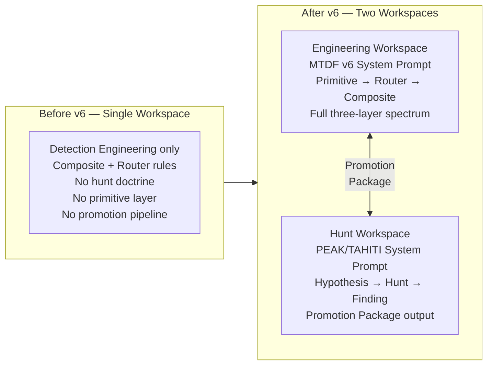

---

## Part II — The Two Workspaces

### Overview

The framework consists of two AnythingLLM workspaces operating as complementary halves of a complete detection programme. Neither workspace replaces the other. They are sequential, not parallel.

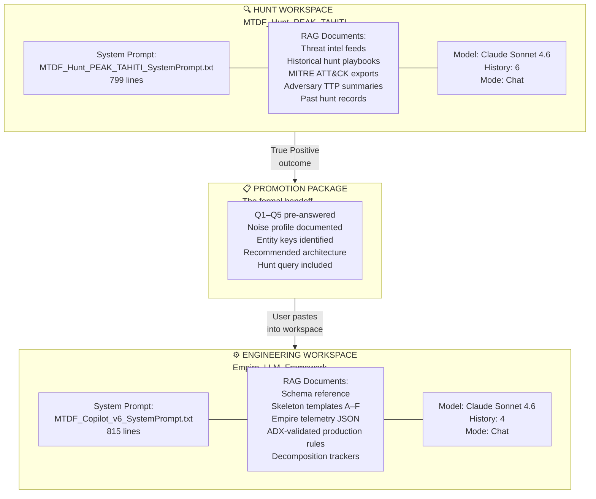

### Why Two Workspaces and Not One

The two workspaces need completely different knowledge bases and question sets. A user mid-hypothesis should not be asked "is this a router rule or a composite?" They have not validated whether the technique even exists in their environment yet. A user building a composite should not be asked "what triggered this hunt?" They already know what they are building.

| Property | Hunt Workspace | Engineering Workspace |
|----------|---------------|----------------------|
| Purpose | Investigate and validate | Build and deploy |
| Question set | Hypothesis · data · scope | Technique · noise · coverage |
| Output | Hunt queries · Hunt records · Promotion packages | Primitives · Router rules · Composites |
| RAG documents | Threat intel · adversary TTPs | Schema · skeletons · telemetry |
| History setting | 6 (hypotheses evolve) | 4 (rules are self-contained) |
| Lifecycle | Session-based investigation | Permanent production artefacts |

---

## Part III — The Three-Layer Inference Spectrum

### All Layers Are Hunts

The most important concept in this framework: **every layer is a threat hunt**. What changes is the claim being made and how much evidence is required to make it.

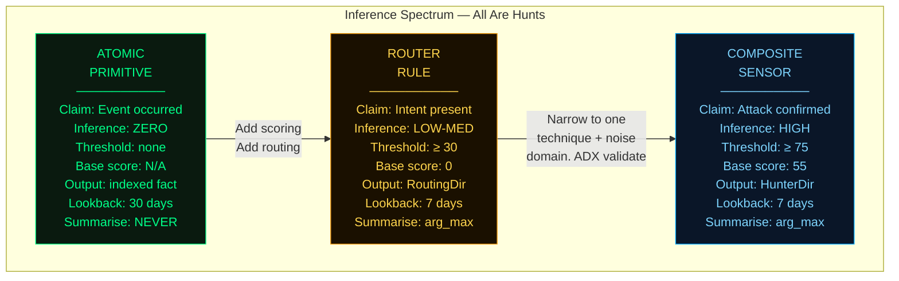

### The Claim Each Layer Makes

| Layer | Hunt Claim | Evidence Required | Analyst Action |
|-------|-----------|------------------|----------------|
| **Primitive** | "This event occurred" | The event itself — zero interpretation | Index it · stitch it later |
| **Router Rule** | "Adversary intent is present" | Convergence of intent signals | Triage — run composite on DeviceId |
| **Composite** | "This specific attack occurred" | Minimum truth anchor + reinforcement | Investigate — create incident |

### What Happens When You Strip a Router Rule Down

Remove the scoring, remove the routing, keep only Phase 1 — you get a primitive collector. This is the strip-down operation.

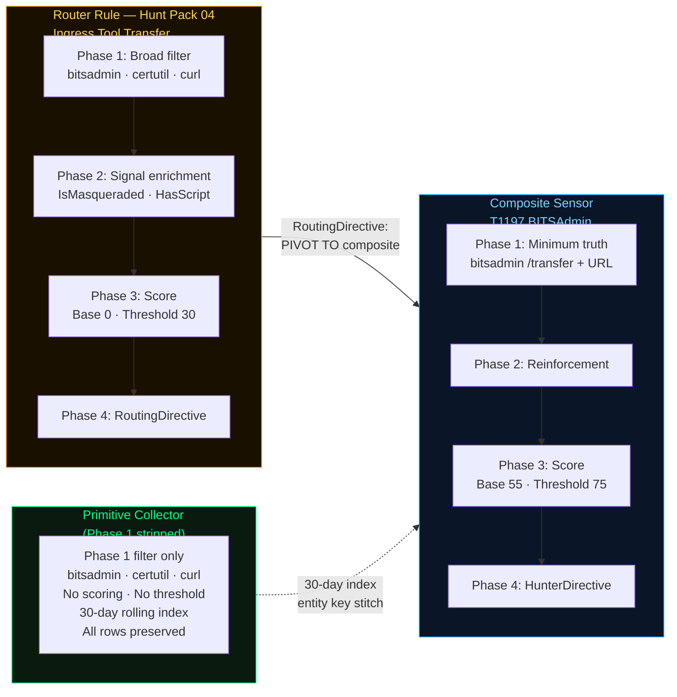

---

## Part IV — The Engineering Workspace: MTDF v6

### The Classification Protocol

The Engineering Copilot cannot generate a single line of KQL until it has run the classification protocol. This is enforced in the system prompt — it is not optional.

The five classification questions:

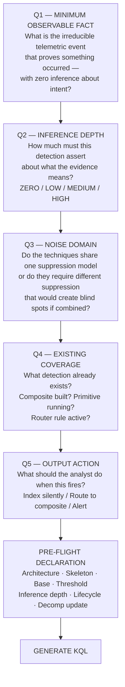

### The Seven Architectures

| Architecture | Name | When | Base | Threshold | Output |
|-------------|------|------|------|-----------|--------|
| 1 | Composite Sensor | Single technique, high fidelity | 55 | ≥ 75 | HunterDirective |
| 2 | Router Rule | Multi-technique, different noise | 0 | ≥ 30 | RoutingDirective |
| 3 | Composite Pack | Multi-technique, same noise | 55 each | ≥ 75 each | HunterDirective each |
| 4 | Hunt Query | One-time investigation | None | None or ≥ 10 | Analyst context |
| 5 | Router + Composite Pair | Breadth now, depth building | 0 / 55 | 30 / 75 | Both directives |
| 6 | Primitive Collector | Atomic substrate indexing | N/A | None | Indexed fact |
| 7 | Full Pipeline | All three layers | All | All | All |

### The Architecture Decision Flowchart

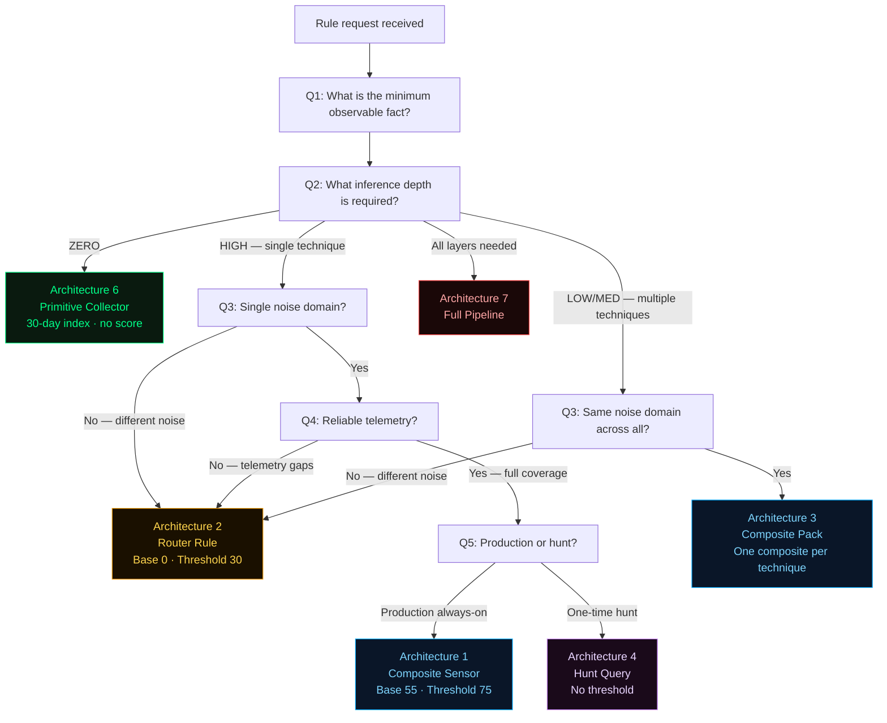

### The Non-Negotiable Scoring Rules

```
╔══════════════════════════════════════════════════════════════╗
║  PRIMITIVE:   Base = N/A    Threshold = NONE   Summarise: NO ║
║  ROUTER RULE: Base = 0      Threshold = ≤ 30               ║
║  COMPOSITE:   Base = 55     Threshold = ≥ 75               ║
║                                                              ║
║  Violating either:                                          ║
║  Router at 55  → untuneable across noise domains            ║
║  Composite at 0 → no minimum truth anchor                   ║
║  Primitive with arg_max → timeline destroyed                ║
╚══════════════════════════════════════════════════════════════╝
```

### Skeleton Templates

The Engineering Copilot uses six skeleton templates. Each is loaded as a RAG document in the workspace.

| Skeleton | Name | Use For |
|----------|------|---------|
| **F** | Primitive Collector | Architecture 6 — atomic substrate indexing |
| **Router** | Router Rule | Architecture 2 — multi-technique triage |
| **A** | Substrate-First Composite (MDE) | Architecture 1/3 — WMI, BYOVD, kernel loads |
| **B** | Intent-First Composite (MDE) | Architecture 1/3 — PowerShell, LOLBins, bitsadmin |
| **C** | Sentinel KQL | Architecture 1/3 — SecurityEvent, Sysmon, AuditLogs |
| **D** | Intent-First Splunk SPL | Architecture 1/3 — Splunk ES environments |
| **E** | Substrate-First Splunk SPL | Architecture 1/3 — Splunk ES environments |

---

## Part V — The Hunt Workspace: PEAK/TAHITI

### PEAK — The Three Hunt Types

Every hunt is classified into one of three types before proceeding. The type determines the question set and query style.

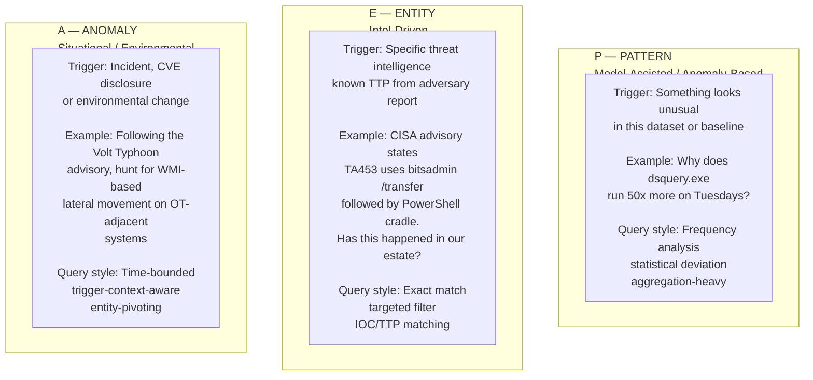

### TAHITI — The Six-Phase Hunt Lifecycle

Every hunt follows all six phases. The Copilot tracks which phase is active and will not skip phases.

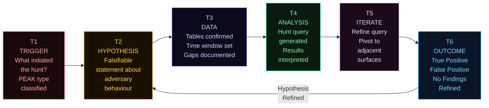

### The Hunt Intake Form — Six Questions

The Hunt Copilot presents all six questions before generating any KQL:

| Question | What It Establishes | TAHITI Phase |
|----------|--------------------|-----------   |
| Q1 — Trigger | PEAK type classification | T1 |
| Q2 — Technique | Hunt surface · tables · fields | T2 |
| Q3 — Hypothesis | Falsifiable statement | T2 |
| Q4 — Data Sources | Tables · time window · gaps | T3 |
| Q5 — Scope | Estate · time · priority | T3 |
| Q6 — Promotion Intent | Planned MTDF output layer | T6 planning |

### TAHITI Outcomes

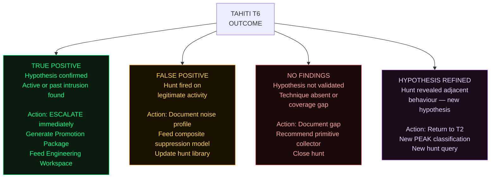

---

## Part VI — How They Work Together

### The Relationship Is Sequential, Not Parallel

PEAK/TAHITI is not an alternative to router rules and composites. It is the investigative phase that tells you what to build. The hunt produces evidence. The evidence informs the architecture decision. The architecture decision produces the production rule.

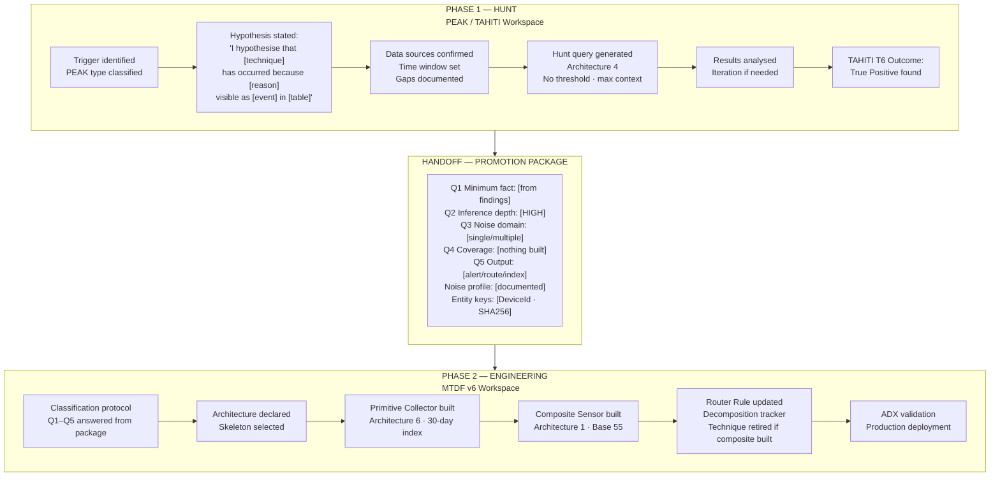

### The Noise Profile — The Critical Connection

The noise profile documented during a hunt is the raw material for the composite suppression model. Without a hunt, the suppression penalties in a router rule or composite are guesses. With a hunt, they are calibrated evidence.

When Hunt Pack 07 soft down-scores `IsAdminAccount` by 20 points — that penalty should have come from a hunt that established exactly what proportion of dsquery executions in the environment are from known admin accounts. If 90% of dsquery runs are from domain admin service accounts, a 20-point penalty is correct. If only 10% are, the penalty needs to be higher. Only a hunt tells you this.

---

## Part VII — Simulated Scenario: Full Pipeline

This section walks through a complete real-world scenario from initial trigger to production deployment. The scenario covers all three layers and both workspaces.

**Scenario:** Your threat intelligence team receives a report that a ransomware group is using PowerShell Empire C2 with BITSAdmin-based payload staging followed by credential harvesting via comsvcs.dll MiniDump.

---

### Step 1 — Open the Hunt Workspace

The analyst opens the `MTDF_Hunt_PEAK_TAHITI` workspace and describes the trigger. The Copilot presents the Hunt Intake Form.

---

**HUNT INTAKE FORM — Simulated Exchange:**

**Copilot:** Before generating any hunt queries, I need to understand the full picture. Please answer these six questions:

**Q1 — What triggered this hunt?**
*(a) Threat intelligence / adversary report (b) Internal anomaly (c) Incident/CVE (d) Proactive*

**Q2 — What adversary behaviour or technique are you hunting for?**
*(Be as specific as possible — tool, method, expected telemetry)*

**Q3 — State your hypothesis:**
*"I hypothesise that [technique] has occurred because [reason], which would be visible as [observable] in [table]."*

**Q4 — What telemetry is available?**
*(Platform, tables, time window, known gaps)*

**Q5 — What is the scope of this hunt?**
*(All devices / targeted group / specific time range)*

**Q6 — If the hypothesis is validated, what is the intended outcome?**
*(Primitive / Composite / Router Rule / Full Pipeline / Documentation only)*

---

**User answers:**

**Q1:** Threat intelligence report — ransomware group TTP
**Q2:** BITSAdmin /transfer staging to AppData\Local\Temp, followed immediately by PowerShell cradle executing the payload, followed by rundll32 comsvcs.dll MiniDump against LSASS
**Q3:** I hypothesise that the threat actor staged a payload via bitsadmin.exe /transfer to a user-writable path, which would be visible as bitsadmin.exe with /transfer flag and a remote URL in DeviceProcessEvents, followed within 10 minutes by a PowerShell process with IEX or encoded command on the same DeviceId
**Q4:** MDE Advanced Hunting — DeviceProcessEvents, DeviceFileEvents. 30-day lookback. No known gaps. Full MDE P2 licensing.
**Q5:** All devices. Last 30 days. Not an active incident — proactive threat hunt.
**Q6:** Full Pipeline — I want primitives, composites, and to update the ingress transfer router rule

---

**Copilot outputs the Hunt Brief:**

```
HUNT BRIEF
──────────────────────────────────────────────────────────────────────────────
PEAK Type         : E — Entity (Intel-Driven)
TAHITI Phase      : T1 ✅ Trigger → T2 ✅ Hypothesis → T3 ✅ Data confirmed
Trigger           : Ransomware group TTP — threat intelligence report
Technique         : T1197 BITSAdmin staging + T1059.001 PowerShell cradle
                    + T1003.001 LSASS comsvcs MiniDump
Hypothesis        : BITSAdmin /transfer staging followed within 10min by
                    PowerShell IEX/encoded execution on same DeviceId
Platform          : MDE Advanced Hunting
Tables            : DeviceProcessEvents · DeviceFileEvents
Time Window       : 30 days
Known Gaps        : None identified
Estate Scope      : All devices
Promotion Intent  : Full Pipeline — Architecture 7
Hunt Architecture : Architecture 4 — Hunt Query
──────────────────────────────────────────────────────────────────────────────
```

---

### Step 2 — Hunt Query Generated (TAHITI T4)

The Copilot generates the hunt query:

```kql
// ============================================================================
// HUNT QUERY: BITSAdmin Staging → PowerShell Cradle Chain
// ============================================================================
// Architecture  : Hunt Query (Architecture 4 — PEAK/TAHITI)
// PEAK Type     : E — Entity (Intel-Driven)
// TAHITI Phase  : T4 — Analysis
// Author        : Ala Dabat | MTDF 2026
// MITRE         : T1197 · T1059.001 · T1003.001
//
// HYPOTHESIS:
// "I hypothesise that the threat actor staged a payload via bitsadmin.exe
//  /transfer to a user-writable path, visible as bitsadmin.exe with /transfer
//  and remote URL in DeviceProcessEvents, followed within 10 minutes by
//  PowerShell with IEX or encoded command on the same DeviceId."
//
// ⚠ HUNT MODE — NOT FOR PRODUCTION DEPLOYMENT ⚠
// All results require analyst review. No automated threshold applied.
// ============================================================================

let lookback = 30d;
let StagingPaths = dynamic([
    "\\appdata\\local\\temp\\","\\users\\public\\",
    "\\windows\\temp\\","\\programdata\\"
]);

// ── HUNT SURFACE: BITSAdmin staging events ──────────────────────────────────
let BitsEvents =
DeviceProcessEvents
| where Timestamp > ago(lookback)
| where FileName =~ "bitsadmin.exe"
| where ProcessCommandLine has "/transfer"
| where ProcessCommandLine matches regex @"(?i)(http[s]?://|ftp://)"
| extend
    HasStagingPath  = toint(tolower(ProcessCommandLine) has_any (StagingPaths)),
    HasRemoteURL    = toint(ProcessCommandLine matches regex @"(?i)(http[s]?://|ftp://)"),
    BitsTime        = Timestamp
| project
    BitsTime, DeviceId, DeviceName, AccountName,
    BitsCmd = ProcessCommandLine, HasStagingPath;

// ── HUNT SURFACE: PowerShell cradle events ──────────────────────────────────
let PSEvents =
DeviceProcessEvents
| where Timestamp > ago(lookback)
| where FileName in~ ("powershell.exe","pwsh.exe")
| where ProcessCommandLine has_any (
    "iex","invoke-expression","-enc","-encodedcommand",
    "downloadstring","invoke-webrequest","iwr"
)
| extend PSTime = Timestamp
| project PSTime, DeviceId, PSCmd = ProcessCommandLine;

// ── CHAIN CORRELATION: BITSAdmin → PowerShell within 10 minutes ─────────────
BitsEvents
| join kind=inner (PSEvents) on DeviceId
| where PSTime > BitsTime
| where datetime_diff("minute", PSTime, BitsTime) <= 10
| extend ChainGapMinutes = datetime_diff("minute", PSTime, BitsTime)
| extend HuntSignals = strcat(
    "[BITS_STAGING] ",
    iif(HasStagingPath == 1, "[WRITABLE_PATH] ", ""),
    "[PS_FOLLOWON] ",
    iif(ChainGapMinutes <= 2, "[RAPID_CHAIN — HIGH CONFIDENCE] ", "")
)

// ── ANALYST OUTPUT ───────────────────────────────────────────────────────────
| project
    BitsTime, PSTime, ChainGapMinutes,
    DeviceName, AccountName, DeviceId,
    BitsCmd, PSCmd, HuntSignals
| sort by ChainGapMinutes asc

// ── HUNT ANALYST NOTES ──────────────────────────────────────────────────────
// WHAT TO LOOK FOR:
//   ChainGapMinutes < 2 = very high confidence — manual payload execution
//   ChainGapMinutes 2-10 = moderate confidence — automated or scheduled
//   BitsCmd with AppData path = payload staging confirmed
//   PSCmd with -enc or IEX = in-memory execution — decode the payload
//
// NOISE INDICATORS:
//   SCCM/Intune operations use bitsadmin legitimately — check AccountName
//   Windows Update uses BITSAdmin — check InitiatingProcessFileName
//
// PIVOT RECOMMENDATIONS:
//   1. On DeviceId — pivot to DeviceFileEvents to find the dropped file
//   2. On AccountName — check for lateral movement post-compromise
//   3. On BitsCmd URL — extract domain and pivot DeviceNetworkEvents estate-wide
//   4. On PSCmd — decode if -enc, look for comsvcs/MiniDump in follow-on events
```

---

### Step 3 — Hunt Results and Iteration (TAHITI T5)

**Simulated result:** Three devices show the chain. Two are SCCM-managed endpoints where bitsadmin is used by ccmexec.exe — false positives. One device shows bitsadmin invoked from cmd.exe spawned by winword.exe — confirmed suspicious.

**Copilot iteration suggestion:**

*"The SCCM noise is significant — two of three hits are legitimate management activity. This is exactly the noise profile data we need for the composite suppression model. For the confirmed device: I recommend pivoting to DeviceFileEvents to find what was dropped, then checking for comsvcs.dll in subsequent ProcessEvents. Add this query:"*

```kql
// PIVOT HUNT: Follow-on LSASS dump after BITSAdmin staging
// TAHITI T5 — Iteration pivot query

let lookback = 30d;
let TargetDevice = "WORKSTATION-COMPROMISED";  // Replace with actual DeviceName

DeviceProcessEvents
| where Timestamp > ago(lookback)
| where DeviceName =~ TargetDevice
| where ProcessCommandLine has_any ("comsvcs","minidump","MiniDump")
    or (FileName =~ "rundll32.exe"
        and ProcessCommandLine matches regex @"(?i)(comsvcs|#24)")
| project Timestamp, FileName, ProcessCommandLine,
          InitiatingProcessFileName, AccountName
| sort by Timestamp asc
```

---

### Step 4 — TAHITI T6 Outcome: True Positive

LSASS dump confirmed on the target device. The Copilot generates the Promotion Package.

```
══════════════════════════════════════════════════════════════════════════════
MTDF PROMOTION PACKAGE — FROM HUNT WORKSPACE
══════════════════════════════════════════════════════════════════════════════
Generated by    : MTDF Hunt Copilot (PEAK/TAHITI)
PEAK Type       : E — Entity (Intel-Driven)
TAHITI Outcome  : TRUE POSITIVE — Hypothesis validated

HUNT SUMMARY:
Techniques      : T1197 BITSAdmin staging · T1059.001 PowerShell cradle
                  T1003.001 LSASS comsvcs MiniDump
Evidence        : BITSAdmin /transfer to AppData\Local\Temp from cmd.exe
                  spawned by winword.exe. PowerShell IEX chain 3 minutes later.
                  rundll32 comsvcs MiniDump 8 minutes after PowerShell.
Entity Keys     : DeviceId=[X] · AccountName=jsmith · SHA256=[hash of dropped file]

CLASSIFICATION ANSWERS FOR ENGINEERING WORKSPACE:
Q1 Minimum fact   : bitsadmin.exe with /transfer flag + external URL + AppData path
Q2 Inference depth: HIGH (for composite) / ZERO (for primitive)
Q3 Noise domain   : T1197 has SCCM/Intune noise — SINGLE noise domain per technique
                    T1003.001 has AV/EDR noise — SINGLE noise domain
                    These are DIFFERENT noise domains — separate composites required
Q4 Coverage       : T1197 BITSAdmin composite already built ✅
                    T1003.001 LSASS composite — PENDING 🔴
                    Primitives — NOT built for either
Q5 Output action  : Alert and investigate for both

NOISE PROFILE (for suppression models):
  T1197: SCCM/ccmexec.exe parent = legitimate. Windows Update/wuauclt.exe = legitimate.
  Suppress: InitiatingProcessFileName in ("ccmexec.exe","wuauclt.exe","svchost.exe")
  T1003.001: AV/EDR processes open LSASS legitimately. Exclude known AV SHA256 hashes.

RECOMMENDED MTDF ARCHITECTURE:
T1197  : Architecture 6 (Primitive) already built ✅ · Architecture 1 (Composite) ✅
T1003.001: Architecture 6 (Primitive) — BUILD NOW · Architecture 1 (Composite) — BUILD
T1059.001: Architecture 6 (Primitive) ✅ · Architecture 1 (Composite) ✅

DECOMPOSITION TRACKER UPDATE:
Hunt Pack 04 (Ingress Transfer Router) → bitsadmin already ✅ RETIRED
Hunt Pack 04 → PowerShell cradle already ✅ RETIRED
No router update needed for T1003.001 — dedicated composite path

NEXT STEP:
Paste this package into the MTDF v6 Engineering Workspace.
══════════════════════════════════════════════════════════════════════════════
```

---

### Step 5 — Open the Engineering Workspace

The analyst pastes the Promotion Package into the `Empire_LLM_Framework` workspace. The Engineering Copilot runs the classification protocol against the pre-answered questions.

---

**ENGINEERING WORKSPACE — Simulated Exchange:**

**Copilot pre-flight declaration:**

```
MTDF PRE-FLIGHT INFERENCE DECLARATION
────────────────────────────────────────────────────────────────
Request          : Build T1003.001 LSASS comsvcs MiniDump detection (from promotion package)
Layer(s)         : Architecture 6 (Primitive) + Architecture 1 (Composite)
Justification    :
  Q1 Minimum fact  : rundll32.exe invoking comsvcs.dll with MiniDump export + LSASS PID
  Q2 Inference     : ZERO (primitive) then HIGH (composite)
  Q3 Noise domain  : Single — AV/EDR process access to LSASS
                     Suppression: known AV SHA256 exclusion (soft penalty)
  Q4 Coverage      : Primitive not built. Composite not built.
  Q5 Output action : Primitive indexes silently. Composite alerts immediately.
Architecture     : 6 (Primitive) then 1 (Composite)
Skeleton         : F (Primitive) then A Substrate-First (Composite)
Base Score       : N/A (Primitive) then 55 (Composite)
Threshold        : None (Primitive) then >= 75 (Composite)
Output Type      : Indexed Fact then HunterDirective
Lifecycle        : Both Permanent
Decomp Update    : No — T1003.001 not in any router rule
────────────────────────────────────────────────────────────────
Proceeding with: Architecture 6 Primitive Collector first, then Architecture 1 Composite Sensor.
```

---

### Step 6 — Primitive Collector Generated

```kql
// ============================================================================
// PRIMITIVE COLLECTOR: LSASS Access via comsvcs.dll MiniDump
// ============================================================================
// Architecture  : Primitive Collector (Layer 1 — Inference: ZERO)
// Author        : Ala Dabat | MTDF 2026
// Platform      : MDE Advanced Hunting — DeviceProcessEvents
// Lifecycle     : Permanent — 30-day rolling index (silent)
// MITRE         : T1003.001
//
// INFERENCE DEPTH: ZERO
//   Claim: "rundll32.exe invoked comsvcs.dll with MiniDump"
//   No assertion of intent. No assertion of malice.
//
// ENTITY KEYS: DeviceId · DeviceName · AccountName
// COMPOSITE BACKING: T1003.001 LSASS Composite — BEING BUILT
//
// NOTE: NO summarise. NO arg_max. ALL rows preserved for timeline.
// ============================================================================

let lookback = 30d;

DeviceProcessEvents
| where Timestamp > ago(lookback)
| where FileName =~ "rundll32.exe"
| where ProcessCommandLine has_any ("comsvcs","minidump","MiniDump")
    or ProcessCommandLine matches regex @"(?i)(comsvcs\.dll.*#24|#24.*comsvcs\.dll)"
| project
    Timestamp,
    DeviceId,
    DeviceName,
    AccountName,
    ProcessCommandLine,
    InitiatingProcessFileName,
    InitiatingProcessCommandLine,
    SHA256,
    MITRE = "T1003.001"
| sort by Timestamp asc
```

---

### Step 7 — Composite Sensor Generated

```kql
// ============================================================================
// COMPOSITE SENSOR: LSASS Dump via comsvcs.dll MiniDump — T1003.001
// ============================================================================
// Architecture  : Composite Sensor (Architecture 1 — Inference: HIGH)
// Author        : Ala Dabat | MTDF 2026
// Platform      : MDE Advanced Hunting — DeviceEvents + DeviceProcessEvents
// Lifecycle     : Production-Candidate (ADX validation pending)
// MITRE         : T1003.001 OS Credential Dumping: LSASS Memory
//
// MINIMUM TRUTH ANCHOR:
//   rundll32.exe invoking comsvcs.dll MiniDump export (by name or ordinal #24)
//   on LSASS process — the irreducible credential dump substrate event.
//
// INFERENCE DEPTH: HIGH
//   Claim: "LSASS credential dump via comsvcs MiniDump is confirmed"
//   Base: 55 · Threshold: >= 75
//
// PRIMITIVE BACKING: T1003.001 Primitive Collector ✅ BUILT (above)
//
// SUPPRESSION MODEL (from hunt noise profile):
//   Known AV/EDR processes legitimately access LSASS — soft down-score
//   Exclude known forensics tooling in IT context — soft down-score
//
// MINIMUM FIRE PATHS:
//   Base 55 + BadParent 25 = 80 >= 75 ✓
//   Base 55 + OrdinalForm 20 = 75 >= 75 ✓
//   Base 55 + DumpFileNear 20 = 75 >= 75 ✓
//
// COUSIN SENSORS (build next):
//   1. T1003.001 ProcDump Composite (procdump.exe + -ma lsass)
//   2. T1003.001 Task Manager Dump (Substrate-First — API handle, no cmdline)
//   3. T1003.006 DCSync Composite (non-DC replication rights — network-level)
// ============================================================================

let lookback = 7d;

// Known AV/EDR processes — soft down-score, never hard exclusion
let KnownAVProcesses = dynamic([
    "mssense.exe","sensecncproxy.exe","windefend.exe",
    "msmpeng.exe","avp.exe","savservice.exe"
]);

// ── PHASE 1: MINIMUM TRUTH ──────────────────────────────────────────────────
// WHY THIS IS MINIMUM TRUTH:
// rundll32 + comsvcs.dll + MiniDump (or ordinal #24) = the only way this
// Windows API is legitimately invoked for credential dumping. There is no
// legitimate enterprise use case for this combination outside of AV/EDR.
DeviceProcessEvents
| where Timestamp > ago(lookback)
| where FileName =~ "rundll32.exe"
| where ProcessCommandLine has_any ("comsvcs","minidump","MiniDump")
    or ProcessCommandLine matches regex @"(?i)(comsvcs\.dll.*#24|#24.*comsvcs)"

// ── PHASE 2: NATIVE ENRICHMENT ──────────────────────────────────────────────
// [FIX-8] toint() on all boolean flags
| extend
    // [TECHNIQUE] Ordinal form used to evade string detection
    OrdinalForm   = toint(ProcessCommandLine matches regex @"(?i)#24"),
    // [TECHNIQUE] Named form — MiniDump by export name
    NamedForm     = toint(tolower(ProcessCommandLine) has "minidump"),
    // [PARENT TRUST] Anomalous parent — not a legitimate AV/EDR process
    BadParent     = toint(not(InitiatingProcessFileName in~ (KnownAVProcesses))),
    // [TECHNIQUE] Output file written to staging path
    StagingOutput = toint(ProcessCommandLine has_any (
                        "\\temp\\","\\appdata\\","\\public\\","\\programdata\\")),
    // [OBFUSCATION] Environment variable in path
    EnvVarPath    = toint(ProcessCommandLine matches regex @"%\w+%"),
    // Known AV/EDR — soft penalty, never hard exclusion
    IsKnownAV     = toint(InitiatingProcessFileName in~ (KnownAVProcesses))

// ── PHASE 3: CONVERGENCE SCORING ────────────────────────────────────────────
// SCORING DECISION TABLE:
// ┌──────────────────────┬────────┬──────────────────────────────────────────┐
// │ Signal               │ Points │ Rationale                                │
// ├──────────────────────┼────────┼──────────────────────────────────────────┤
// │ Base (min truth)     │   55   │ comsvcs + MiniDump = structural truth    │
// │ BadParent            │   25   │ Non-AV parent = attacker-controlled      │
// │ OrdinalForm          │   20   │ #24 ordinal = evasion attempt            │
// │ StagingOutput        │   20   │ Dump to writable path = exfil prep       │
// │ EnvVarPath           │   15   │ Env var obfuscation = evasion            │
// │ IsKnownAV (penalty)  │  -20   │ Soft: AV/EDR process — likely legitimate │
// └──────────────────────┴────────┴──────────────────────────────────────────┘
| extend RawScore = 55
    + iff(BadParent == 1,     25, 0)
    + iff(OrdinalForm == 1,   20, 0)
    + iff(StagingOutput == 1, 20, 0)
    + iff(EnvVarPath == 1,    15, 0)
    - iff(IsKnownAV == 1,     20, 0)
| extend RiskScore = iif(RawScore < 0, 0, RawScore)
| where RiskScore >= 75

// ── PHASE 4: HUNTER DIRECTIVE ───────────────────────────────────────────────
| extend HunterDirective = case(
    RiskScore >= 110,
        "CRITICAL — LSASS DUMP CONFIRMED | comsvcs MiniDump with staging path | ISOLATE device | Retrieve dump file immediately | Assume credential compromise | Pivot AccountName to all logon events",
    RiskScore >= 90,
        "HIGH — LSASS DUMP VIA COMSVCS | Ordinal or named form | Check parent process | Scope credential reuse across estate | Review post-dump network activity",
    RiskScore >= 75,
        "MEDIUM — COMSVCS MINIDUMP PATTERN | Verify AV/EDR context | Review surrounding process tree | Check for follow-on lateral movement"
)

// [FIX-1] arg_max — deterministic output
| summarize arg_max(Timestamp, *) by DeviceId, AccountName

| project
    Timestamp, DeviceName, AccountName,
    ProcessCommandLine, InitiatingProcessFileName,
    RiskScore, OrdinalForm, NamedForm,
    BadParent, StagingOutput, EnvVarPath,
    HunterDirective
| sort by RiskScore desc
```

---

### Step 8 — The Full Picture

The complete pipeline for this scenario:

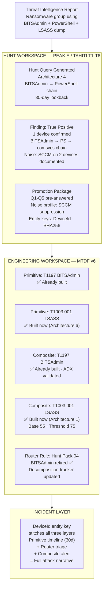

---

## Part VIII — Architecture Decision Reference

### Quick Reference — When to Use Each Architecture

| Scenario | Architecture | Why |
|----------|-------------|-----|
| "I want to capture all bitsadmin executions for retrospective analysis" | 6 — Primitive | Zero inference, index everything, 30-day rolling |
| "I want a high-confidence alert for bitsadmin /transfer to staging paths" | 1 — Composite | Single technique, single noise domain, minimum truth clear |
| "I want coverage for bitsadmin, certutil, and curl — all of them" | 2 — Router Rule | Different noise domains (SCCM vs PKI vs DevOps) |
| "I want coverage for rundll32, regsvr32, and mshta — same suppression model" | 3 — Composite Pack | Same suppression model — combine in pack |
| "I want to investigate if ransomware staging has happened in my estate" | 4 — Hunt Query | Investigation, not production deployment |
| "I need breadth now and will build composites next" | 5 — Router + Composite Pair | Interim coverage while composites are built |
| "Give me all three layers for bitsadmin abuse" | 7 — Full Pipeline | Primitive + Composite + Router update |

### The Noise Domain Decision Table

The single most important question in architecture selection:

| Tool | Primary Noise | Suppression Required | Can Share With |
|------|--------------|---------------------|----------------|
| `bitsadmin.exe` | SCCM · Windows Update · Intune | Managed endpoint lineage | Nothing — unique noise |
| `certutil.exe` | PKI · developer tooling | Dev machine + IT baseline | Nothing — unique noise |
| `curl.exe` | DevOps CI/CD · REST API testing | CI/CD runner context | Nothing — unique noise |
| `rundll32.exe` | COM activation · print spooler | spoolsv/dllhost parent | regsvr32, mshta (same suppression) |
| `regsvr32.exe` | Software install · COM registration | msiexec parent + publisher | rundll32, mshta (same suppression) |
| `mshta.exe` | Legacy HTA · Group Policy scripts | Known HTA path + signed | rundll32, regsvr32 (same suppression) |
| `dsquery.exe` | AD admin · domain management | Domain admin service accounts | nltest (same suppression) |
| `net.exe` | Everything in enterprise | Impossible to fully suppress | Nothing — too noisy for composites |

---

## Part IX — Workspace Configuration

### Engineering Workspace Setup

```
Workspace Name  : Empire_LLM_Framework
System Prompt   : MTDF_Copilot_v6_SystemPrompt.txt (815 lines)
Model           : Claude Sonnet 4.6
Temperature     : 0 (deterministic output — rules must be reproducible)
Mode            : Chat (NOT Agent, NOT Query)
History         : 4 (prevent context poisoning across rules)

RAG Documents:
├── MTDF_Schema_Complete_Reference.txt
├── MTDF_Schema_MDE.txt
├── MTDF_Schema_Sentinel.txt
├── MTDF_Skeleton_A_SubstrateFirst.txt
├── MTDF_Skeleton_B_IntentFirst.txt
├── MTDF_Skeleton_C_Sentinel.txt
├── cmd_bitsadmin_download_psh_script.json  ← Empire telemetry
├── [ADX-validated production rules as quality examples]
└── [Decomposition tracker documents]
```

### Hunt Workspace Setup

```
Workspace Name  : MTDF_Hunt_PEAK_TAHITI
System Prompt   : MTDF_Hunt_PEAK_TAHITI_SystemPrompt.txt (799 lines)
Model           : Claude Sonnet 4.6
Temperature     : 0
Mode            : Chat
History         : 6 (hypotheses evolve across exchanges)

RAG Documents:
├── [Threat intelligence reports — adversary TTPs]
├── [Historical hunt records — past findings]
├── [MITRE ATT&CK navigator exports]
├── [Adversary group profiles — TA453, Volt Typhoon, etc.]
└── [False positive noise profiles — documented per technique]
```

### Session Management Rules

Both workspaces follow the same session management doctrine:

- **One technique per thread** — never mix techniques in one conversation
- **New thread per rule** — prevents context contamination
- **Open hunt workspace first** — if the technique has not been hunted, hunt before engineering
- **Paste Promotion Package** — do not summarise from memory — paste the full package

---

## Part X — The Promotion Pipeline

### From Hunt to Production — The Complete Path

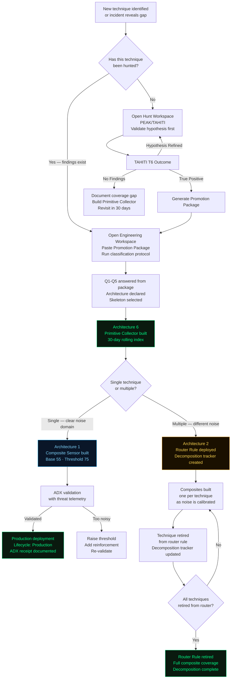

### Promotion Checklist

Before promoting a hunt finding to an MTDF production rule, confirm every item:

| Requirement | Primitive | Router Rule | Composite |
|-------------|-----------|-------------|-----------|
| Minimum observable fact stated | ✅ Required | ✅ Required | ✅ Required |
| Noise calibration complete | ❌ Not required | ✅ Required | ✅ Required |
| ADX validation receipt | ❌ Not required | ❌ Not required | ✅ Required |
| Decomposition tracker | ❌ Not required | ✅ Required | ❌ Not required |
| Primitive backing exists | N/A | ✅ Recommended | ✅ Required |
| Base score correct | N/A | 0 only | 55 only |
| Threshold correct | None | ≤ 30 | ≥ 75 |
| Lifecycle state in header | ✅ Required | ✅ Required | ✅ Required |

---

## Part XI — Version History

| Version | Key Addition | Trigger |
|---------|-------------|---------|
| v1 | Basic structure, schema reference | First generation |
| v2 | Schema precision, field corrections | Hallucination errors |
| v3 | Ten engineering rules | Production bug review of 11 rules |
| v4 | Cousin doctrine · Empire context · Splunk support | Quality review |
| v5 | Classification protocol · Router rule doctrine | Ingress tool transfer case study |
| v6 | Three-layer model · Primitive Collector (Arch 6) · Full Pipeline (Arch 7) · Skeleton F · Strip-down/promotion operations · 18 operational rules | Primitives doctrine session + Gemini/DeepSeek analysis corrections |
| Hunt v1 | PEAK/TAHITI Hunt Workspace · Six-question intake form · Architecture 4 · Promotion Package · Hunt Record format · Full technique coverage matrix | Detection lifecycle completion |

### What Each Version Fixed

**v3 → Engineering rules:** Any() non-determinism, make_set_if, leftouter ghost chains, null SHA256 rarity, prevalence window overlap, substring length guard.

**v5 → Classification protocol:** Prevented the most common architectural error — generating a composite when a router rule is needed, or a router rule when a composite is needed.

**v6 → Three-layer model:** Formalised the primitive layer, added Architecture 6 and 7, corrected Gemini/DeepSeek errors (primitive with arg_max, cannot-jump constraint, skeleton naming conflict, Part 7 too short).

**Hunt v1 → Hunt lifecycle:** Connected investigative hunting to production engineering via the Promotion Package. Prevented the most common programme failure — validated hunt findings that never get engineered into permanent rules.

---

```
╔══════════════════════════════════════════════════════════════════════════════╗
║                     MTDF FINAL PRINCIPLE                                     ║
║                                                                              ║
║  Hunt first. Build on evidence, not assumption.                             ║
║  The primitive is the net. The router is the structured hunt.               ║
║  The composite is the anchor. The incident is the story.                    ║
║                                                                              ║
║  All three layers are hunts.                                                ║
║  What changes is the claim being made,                                      ║
║  the evidence required to make it,                                          ║
║  and the action the analyst takes when it fires.                            ║
║                                                                              ║
║  A router rule without a decomposition tracker is coverage debt.            ║
║  A composite without a primitive backing it is a gap in the 30-day index.  ║
║  A hunt finding that never becomes a rule is institutional knowledge lost.  ║
╚══════════════════════════════════════════════════════════════════════════════╝
```

---

*Author: Ala Dabat | [github.com/azdabat](https://github.com/azdabat)*  
*Licensed under [CC BY-NC-SA 4.0](https://creativecommons.org/licenses/by-nc-sa/4.0/legalcode)*  
*Attribution required · Non-commercial use only · ShareAlike*
