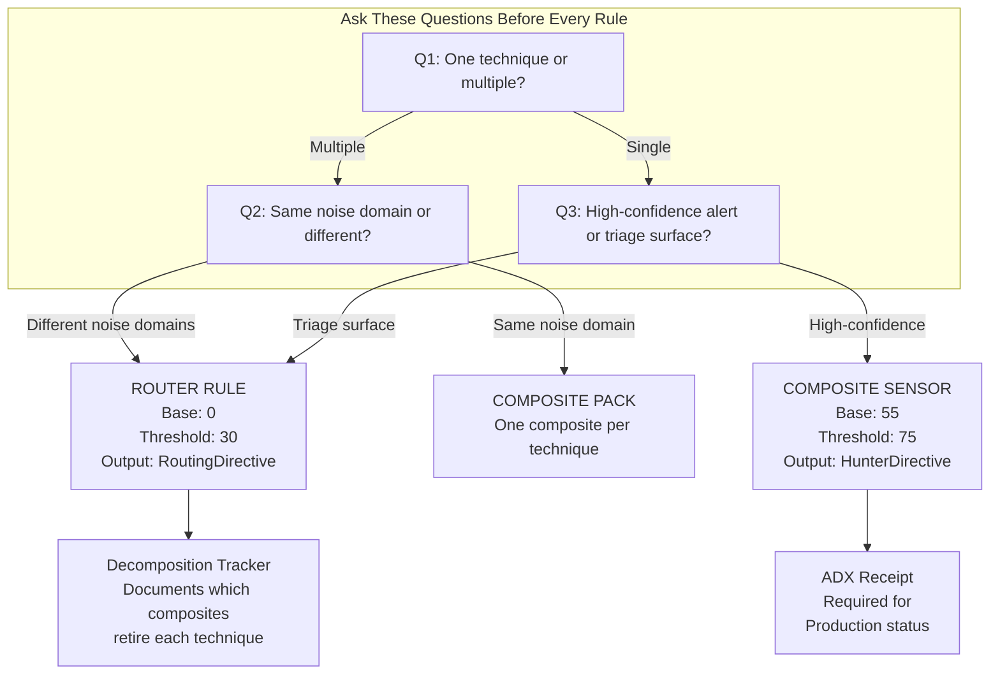
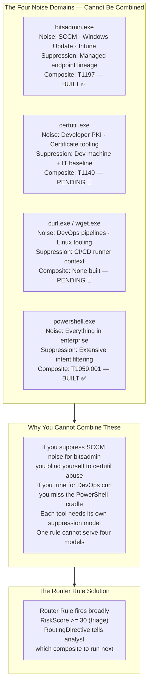
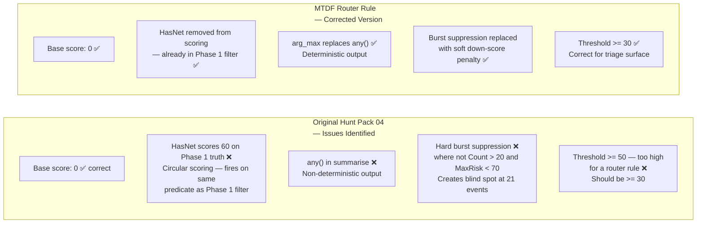
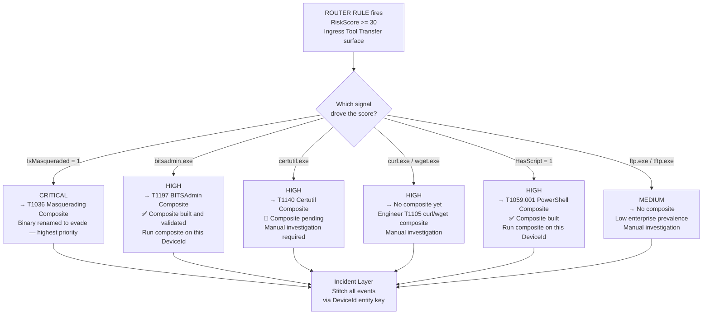
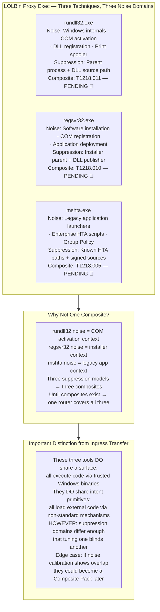
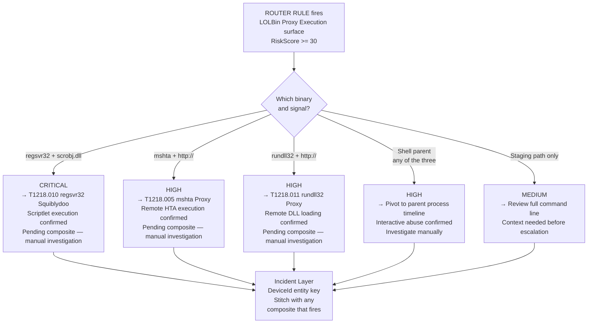
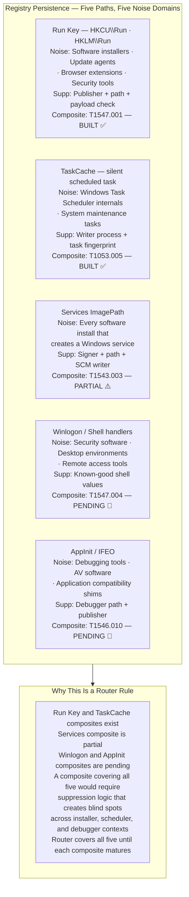
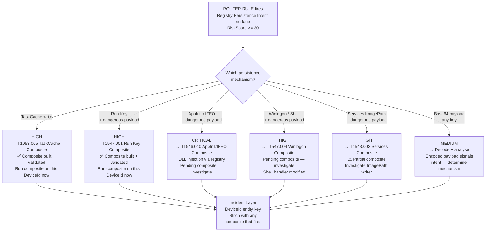
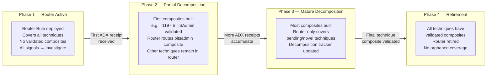

# MTDF Router Rules — Reference & Example Pack
### Canonical Examples of Surface Aggregators in the Minimum Truth Detection Framework

**Author:** Ala Dabat | 2026  
**Framework:** [Minimum Truth Detection Framework](https://github.com/azdabat/Minimum-Truth-Detection-Framework-ADX-Validated-Composite-Rules)  
**License:** [CC BY-NC-SA 4.0](https://creativecommons.org/licenses/by-nc-sa/4.0/legalcode)

---

> *"Router rules detect intent.*  
> *Ecosystem composites confirm truth.*  
> *A router rule that is never retired is coverage debt, not architecture."*

---

## What This Document Is

This document contains three production router rules with full architectural explanation. Each rule is accompanied by a clear rationale for why it is a router rule and not a composite sensor, a decomposition tracker documenting which composites must be built to retire it, and a mermaid diagram showing the routing flow.

These are not simplified examples. They are the actual rules in use within the MTDF detection estate, with the architectural decisions documented in full.

---

## Table of Contents

- [The Router Rule Doctrine — Quick Reference](#the-router-rule-doctrine--quick-reference)
- [Rule 1 — Ingress Tool Transfer (Hunt Pack 04)](#rule-1--ingress-tool-transfer-hunt-pack-04)
- [Rule 2 — LOLBin Proxy Execution Surface](#rule-2--lolbin-proxy-execution-surface)
- [Rule 3 — Registry Persistence Intent Surface](#rule-3--registry-persistence-intent-surface)
- [The Decomposition Pipeline](#the-decomposition-pipeline)

---

## The Router Rule Doctrine — Quick Reference



### The Two Non-Negotiable Scoring Rules

| Rule Type | Base Score | Threshold | Output | Purpose |
|-----------|-----------|-----------|--------|---------|
| **Router Rule** | **0** — always | **≤ 30** — always | RoutingDirective | Triage surface — directs to composites |
| **Composite Sensor** | **55** — always | **≥ 75** — always | HunterDirective | Production alert — confirms minimum truth |

Violating either produces a rule that is either untuneable (router at 55) or meaningless as an alert (composite at 0).

---

## Rule 1 — Ingress Tool Transfer (Hunt Pack 04)

### Why This Is a Router Rule



**The precise reason this cannot be a composite:** A composite sensor requires a single noise model. The suppression logic for bitsadmin (exclude SCCM lineage, Intune runner context, Windows Update orchestrators) is completely incompatible with the suppression logic for certutil (exclude developer certificate operations, PKI renewal workflows, code signing pipelines). Writing a single suppression block that covers both creates a suppression that either misses attacker activity on one surface or generates unacceptable noise on the other. Four tools, four suppression models — four composites. Until those composites exist, one router rule bridges the gap.

### Architectural Comparison



### The Rule

```kql
// ============================================================================
// ROUTER RULE: Ingress Tool Transfer — Evasion-Aware Surface
// Architecture: Router Rule (Architecture 2) — Triage Surface
// Author: Ala Dabat | MTDF 2026
// Lifecycle: Router (Temporary)
// Platform: MDE Advanced Hunting
//
// WHY THIS IS A ROUTER RULE:
// Seven LOLBin downloaders with seven different enterprise noise profiles.
// Each requires a separate suppression model. A composite that combines them
// cannot be tuned without creating blind spots across noise domains.
// This rule surfaces ingress transfer intent and routes to dedicated composites.
//
// DECOMPOSITION STATUS:
// ┌──────────────────────┬─────────────────────────────┬──────────────────────┐
// │ Technique            │ Composite Status             │ Action               │
// ├──────────────────────┼─────────────────────────────┼──────────────────────┤
// │ bitsadmin /transfer  │ T1197 Composite — BUILT      │ RETIRE from router   │
// │ certutil -urlcache   │ T1140 Composite — pending    │ Keep in router       │
// │ curl / wget -o       │ No composite yet             │ Keep in router       │
// │ ftp / tftp           │ No composite planned         │ Keep in router       │
// │ PowerShell cradle    │ T1059.001 Composite — BUILT  │ RETIRE from router   │
// │ IsMasqueraded signal │ T1036 Composite — pending    │ Keep in router       │
// └──────────────────────┴─────────────────────────────┴──────────────────────┘
//
// Base = 0 — signals build from zero. No minimum truth established.
// Threshold = 30 — triage surface, not production alert.
// ============================================================================

let lookback = 7d;

// Router scope: LOLBin downloaders across different noise domains
// Note: bitsadmin and PowerShell have dedicated composites — these
// remain here until composites are confirmed ADX-validated and deployed.
let TargetProcs = dynamic([
    "certutil.exe", "bitsadmin.exe", "curl.exe", "wget.exe",
    "ftp.exe", "tftp.exe", "powershell.exe"
]);
let SuspiciousParents = dynamic([
    "cmd.exe", "winword.exe", "excel.exe", "outlook.exe",
    "wscript.exe", "cscript.exe", "mshta.exe"
]);
let SuspiciousDirs = dynamic([
    "\\Users\\Public", "\\ProgramData", "\\Windows\\Temp",
    "\\Temp", "\\Downloads",
    "\\AppData\\Local\\Temp", "\\AppData\\Roaming"
]);
// Known management tooling — soft down-score, not hard exclusion
let ManagedParents = dynamic([
    "ccmexec.exe", "intunemanagementextension.exe",
    "taniumclient.exe", "wsus.exe", "wuauclt.exe"
]);

// ── PHASE 1: BROAD SURFACE FILTER ──────────────────────────────────────────
// Cover all ingress transfer techniques regardless of noise domain.
// The router must fire broadly — composites will confirm truth.
DeviceProcessEvents
| where Timestamp > ago(lookback)
| extend
    FileLower = tolower(FileName),
    // [FIX-5 analog] OriginalFileName check for masquerade detection
    OrigLower = tolower(tostring(column_ifexists(
        "ProcessVersionInfoOriginalFileName", ""))),
    HasOrig = isnotempty(tolower(tostring(column_ifexists(
        "ProcessVersionInfoOriginalFileName", ""))))
| where FileLower in~ (TargetProcs)
    or (HasOrig and OrigLower in~ (TargetProcs))
| where ProcessCommandLine has_any (
    "http", "https", "ftp",
    "-urlcache", "-split", "-f", "decode", "encode",
    "/transfer", "/addfile", "/setnotifycmdline", "/resume",
    " -o ", " --output ", " -OutFile ", "--remote-name",
    "invoke-webrequest", "iwr", "invoke-restmethod", "irm",
    "downloadstring", "new-object net.webclient"
)

// ── PHASE 2: SIGNAL ENRICHMENT ──────────────────────────────────────────────
// [FIX-8] toint() for all boolean flags
| extend
    // Masquerade detection — unique value preserved from original Hunt Pack 04
    // This signal is strong enough to route directly to T1036 composite
    IsMasqueraded = toint(HasOrig and FileLower != OrigLower),

    // Network primitive — NOTE: HasNet is NOT scored because it duplicates
    // the Phase 1 filter. Scoring it would be circular (all survivors have it).
    // It is retained as a routing label only.
    HasNet = toint(ProcessCommandLine matches regex @"(?i)(http[s]?://|ftp://)"),

    // Script execution chaining — download + execute pattern
    HasScript = toint(ProcessCommandLine has_any (
        "downloadstring", "iex", "-enc", "frombase64string"
    )),
    // Dangerous DLL staging path
    BadDLLPath = toint(
        ProcessCommandLine has ".dll"
        and ProcessCommandLine has_any (SuspiciousDirs)
    ),
    // Shell/Office parent — interactive or macro-driven abuse
    BadParent = toint(
        InitiatingProcessFileName in~ (SuspiciousParents)
    ),
    // Known management tooling — soft penalty signal
    IsManagedParent = toint(
        InitiatingProcessFileName in~ (ManagedParents)
    ),
    // Destination path is user-writable staging location
    IsStagingPath = toint(
        ProcessCommandLine has_any (SuspiciousDirs)
    )

// ── PHASE 3: ROUTING SCORE ──────────────────────────────────────────────────
// Base = 0 — router rule. Signals build the case from zero.
// [FIX-7] Explicit int comparisons throughout
// [FIX-10] Floor at zero after penalties
| extend RawScore = 0
    + iff(IsMasqueraded == 1,  50, 0)  // Renamed binary — strongest router signal
    + iff(HasScript == 1,      25, 0)  // Download + exec chain
    + iff(BadDLLPath == 1,     20, 0)  // DLL staged to writable path
    + iff(BadParent == 1,      15, 0)  // Shell/Office spawn
    + iff(IsStagingPath == 1,  10, 0)  // User-writable drop path
    // Soft down-score for managed tooling — not hard exclusion
    - iff(IsManagedParent == 1, 15, 0)

// [FIX-10] Floor at zero
| extend RiskScore = iif(RawScore < 0, 0, RawScore)

// Router threshold — lower than composite, this is triage not alert
| where RiskScore >= 30

// ── PHASE 4: ROUTING DIRECTIVE ──────────────────────────────────────────────
// Not a HunterDirective — a RoutingDirective.
// Each branch tells the analyst which composite sensor to execute next.
| extend RoutingDirective = case(
    IsMasqueraded == 1,
        "CRITICAL → PIVOT TO: T1036 Masquerading Composite | Renamed LOLBin confirmed",
    FileLower =~ "bitsadmin.exe",
        "HIGH → PIVOT TO: T1197 BITSAdmin Composite | Composite built — use it",
    FileLower =~ "certutil.exe",
        "HIGH → PIVOT TO: T1140 Certutil Composite | Composite pending — investigate",
    FileLower in~ ("curl.exe", "wget.exe"),
        "HIGH → INVESTIGATE: No composite yet | Engineer T1105 curl/wget composite",
    HasScript == 1,
        "HIGH → PIVOT TO: T1059.001 PowerShell Cradle Composite | Composite built",
    FileLower in~ ("ftp.exe", "tftp.exe"),
        "MEDIUM → INVESTIGATE: Legacy transfer tool | Low prevalence — investigate",
    "MEDIUM → INVESTIGATE: Ingress transfer intent | Route to appropriate composite"
)

// [FIX-1] arg_max — never any() — locks all columns to consistent row
| summarize arg_max(Timestamp, *) by DeviceId, AccountName, FileName

| project
    Timestamp,
    DeviceName,
    AccountName,
    FileName,
    ProcessCommandLine,
    InitiatingProcessFileName,
    RiskScore,
    IsMasqueraded,
    HasScript,
    BadParent,
    IsStagingPath,
    RoutingDirective
| sort by RiskScore desc
```

### Routing Flow



---

## Rule 2 — LOLBin Proxy Execution Surface

### Why This Is a Router Rule



**The precise reason this cannot yet be a composite:** rundll32.exe is invoked constantly by Windows internal mechanisms — COM activation, print spooler, DLL registration — in contexts that look superficially similar to attacker use. regsvr32.exe is invoked by software installers throughout enterprise deployment pipelines. mshta.exe is still used by legacy enterprise applications and Group Policy login scripts in regulated environments. The suppression logic for each is different enough that a combined composite would require so many hard exclusions to achieve acceptable noise that those exclusions would create exploitable blind spots. The correct architecture is one router rule now, three composites as each noise domain is baselied and suppression logic is validated.

### The Rule

```kql
// ============================================================================
// ROUTER RULE: LOLBin Proxy Execution — Code Execution via Trusted Binaries
// Architecture: Router Rule (Architecture 2) — Triage Surface
// Author: Ala Dabat | MTDF 2026
// Lifecycle: Router (Temporary)
// Platform: MDE Advanced Hunting
//
// WHY THIS IS A ROUTER RULE:
// rundll32, regsvr32, and mshta share the same adversary goal (proxy execution)
// but have different enterprise noise profiles requiring separate suppression.
// This router surfaces proxy execution intent and routes to dedicated composites.
//
// DECOMPOSITION STATUS:
// ┌──────────────────────┬─────────────────────────────┬──────────────────────┐
// │ Technique            │ Composite Status             │ Action               │
// ├──────────────────────┼─────────────────────────────┼──────────────────────┤
// │ rundll32 proxy exec  │ T1218.011 — pending          │ Keep in router       │
// │ regsvr32 squiblydoo  │ T1218.010 — pending          │ Keep in router       │
// │ mshta.exe proxy      │ T1218.005 — pending          │ Keep in router       │
// └──────────────────────┴─────────────────────────────┴──────────────────────┘
//
// Base = 0 · Threshold = 30 · RoutingDirective output
// ============================================================================

let lookback = 7d;

// LOLBin proxy exec surface — all three in one broad filter
let ProxyBinaries = dynamic(["rundll32.exe", "regsvr32.exe", "mshta.exe"]);

// Soft down-score: known-good parent contexts per binary
let SafeRundll32Parents = dynamic([
    "spoolsv.exe", "dllhost.exe", "svchost.exe"
]);
let SafeRegsvr32Parents = dynamic([
    "msiexec.exe", "setup.exe", "install.exe"
]);

// ── PHASE 1: BROAD SURFACE FILTER ──────────────────────────────────────────
DeviceProcessEvents
| where Timestamp > ago(lookback)
| where FileName in~ (ProxyBinaries)
// Minimum surface filter: must have a suspicious primitive
// We do NOT anchor on binary alone — too noisy across all three tools
| where ProcessCommandLine has_any (
    "http://", "https://",             // Remote URL loading
    "javascript:", "vbscript:",        // Script engine invocation
    "/i:", "scrobj.dll",               // regsvr32 scriptlet
    "shell32.dll,ShellExec",           // rundll32 shell abuse
    ".hta", ".sct", ".wsh",            // Script file types
    "\\AppData\\", "\\Temp\\",         // User-writable path
    "\\Users\\Public\\", "\\ProgramData\\" // Staging locations
)

// ── PHASE 2: SIGNAL ENRICHMENT ──────────────────────────────────────────────
| extend
    // [FIX-8] toint() throughout
    IsRundll32    = toint(FileName =~ "rundll32.exe"),
    IsRegsvr32    = toint(FileName =~ "regsvr32.exe"),
    IsMshta       = toint(FileName =~ "mshta.exe"),

    // Remote URL = strongest signal for all three
    HasRemoteURL  = toint(ProcessCommandLine has_any ("http://", "https://")),

    // Script engine abuse
    HasScriptEng  = toint(ProcessCommandLine has_any (
        "javascript:", "vbscript:", "scrobj.dll", ".sct"
    )),
    // Staging path drop
    HasStagingPath = toint(ProcessCommandLine has_any (
        "\\AppData\\", "\\Temp\\", "\\Users\\Public\\", "\\ProgramData\\"
    )),
    // Shell/Office parent
    HasShellParent = toint(InitiatingProcessFileName has_any (
        "cmd.exe", "powershell.exe", "winword.exe",
        "excel.exe", "outlook.exe", "wscript.exe"
    )),
    // Known safe parents per binary — soft down-score signal
    IsKnownSafeParent = toint(
        (FileName =~ "rundll32.exe" and InitiatingProcessFileName in~ (SafeRundll32Parents))
        or (FileName =~ "regsvr32.exe" and InitiatingProcessFileName in~ (SafeRegsvr32Parents))
    )

// ── PHASE 3: ROUTING SCORE ──────────────────────────────────────────────────
// Base = 0. Signals build from zero.
| extend RawScore = 0
    + iff(HasRemoteURL == 1,    35, 0)  // Remote code source — strong
    + iff(HasScriptEng == 1,    25, 0)  // Script engine abuse
    + iff(HasStagingPath == 1,  15, 0)  // Writable path staging
    + iff(HasShellParent == 1,  15, 0)  // Shell parent anomaly
    // Soft penalty for known-safe parents — not hard exclusion
    - iff(IsKnownSafeParent == 1, 20, 0)

// [FIX-10] Floor at zero
| extend RiskScore = iif(RawScore < 0, 0, RawScore)
| where RiskScore >= 30

// ── PHASE 4: ROUTING DIRECTIVE ──────────────────────────────────────────────
| extend RoutingDirective = case(
    FileName =~ "regsvr32.exe" and HasScriptEng == 1,
        "CRITICAL → PIVOT TO: T1218.010 regsvr32 Squiblydoo Composite | Scriptlet confirmed",
    FileName =~ "mshta.exe" and HasRemoteURL == 1,
        "HIGH → PIVOT TO: T1218.005 mshta Proxy Composite | Remote HTA confirmed",
    FileName =~ "rundll32.exe" and HasRemoteURL == 1,
        "HIGH → PIVOT TO: T1218.011 rundll32 Composite | Remote DLL loading confirmed",
    HasShellParent == 1,
        "HIGH → INVESTIGATE: Shell parent LOLBin proxy | Pivot to parent process timeline",
    "MEDIUM → INVESTIGATE: LOLBin proxy surface | Review command line in full"
)

// [FIX-1] arg_max — deterministic output
| summarize arg_max(Timestamp, *) by DeviceId, AccountName, FileName

| project
    Timestamp, DeviceName, AccountName, FileName,
    ProcessCommandLine, InitiatingProcessFileName,
    RiskScore, IsRundll32, IsRegsvr32, IsMshta,
    HasRemoteURL, HasScriptEng, HasShellParent,
    RoutingDirective
| sort by RiskScore desc
```

### Routing Flow



---

## Rule 3 — Registry Persistence Intent Surface

### Why This Is a Router Rule



**The precise reason this cannot be a single composite:** The registry persistence ecosystem spans five distinct noise domains. Run key noise is dominated by software installers and update agents. TaskCache noise is Windows Scheduler internals. Services ImagePath noise is every application that creates a Windows service — which is most enterprise software. Winlogon and Shell handler noise includes endpoint security products and remote access tools that legitimately modify these keys. AppInit and IFEO noise includes debuggers and application compatibility infrastructure. Combining all five into one composite would require a suppression block so broad that an attacker could trivially evade it by naming their payload after a known-safe writer. The correct architecture is a router rule that surfaces any registry persistence intent, with individual composites handling the high-traffic surfaces where noise calibration has been completed.

**The additional subtlety:** Two composites (Run Key, TaskCache) already exist and are validated. This router rule should route those signals directly to the composites rather than having analysts investigate manually. The router does not compete with validated composites — it routes to them.

### The Rule

```kql
// ============================================================================
// ROUTER RULE: Registry Persistence Intent Surface
// Architecture: Router Rule (Architecture 2) — Triage Surface
// Author: Ala Dabat | MTDF 2026
// Lifecycle: Router (Temporary)
// Platform: MDE Advanced Hunting
//
// WHY THIS IS A ROUTER RULE:
// Five distinct registry persistence mechanisms with five different noise
// domains. Run Key and TaskCache have validated composites — this rule routes
// to them directly. Services, Winlogon, and AppInit/IFEO composites are
// pending. Router bridges the coverage gap while composites mature.
//
// DECOMPOSITION STATUS:
// ┌──────────────────────┬─────────────────────────────┬──────────────────────┐
// │ Technique            │ Composite Status             │ Action               │
// ├──────────────────────┼─────────────────────────────┼──────────────────────┤
// │ Run Key \Run \RunOnce│ T1547.001 — BUILT ✅         │ Route to composite   │
// │ TaskCache silent     │ T1053.005 — BUILT ✅         │ Route to composite   │
// │ Services ImagePath   │ T1543.003 — partial ⚠️       │ Route + investigate  │
// │ Winlogon / Shell     │ T1547.004 — pending 🔴       │ Keep, investigate    │
// │ AppInit / IFEO       │ T1546.010 — pending 🔴       │ Keep, investigate    │
// └──────────────────────┴─────────────────────────────┴──────────────────────┘
//
// Base = 0 · Threshold = 30 · RoutingDirective output
// ============================================================================

let lookback = 7d;

// All registry persistence key paths in scope for this router
let RunKeys = dynamic([
    @"software\microsoft\windows\currentversion\run",
    @"software\microsoft\windows\currentversion\runonce",
    @"software\microsoft\windows nt\currentversion\winlogon"
]);
let TaskCacheKeys = dynamic([
    @"software\microsoft\windows nt\currentversion\schedule\taskcache\tree",
    @"software\microsoft\windows nt\currentversion\schedule\taskcache\tasks"
]);
let ServiceKeys = dynamic([
    @"system\currentcontrolset\services"
]);
let HijackKeys = dynamic([
    @"software\microsoft\windows nt\currentversion\image file execution options",
    @"software\microsoft\windows nt\currentversion\windows\appinit_dlls"
]);

// Dangerous payload indicators in registry values
let DangerTokens = dynamic([
    "powershell", "pwsh", "cmd.exe", "mshta", "wscript", "cscript",
    "rundll32", "regsvr32", "certutil", "bitsadmin", "curl",
    "-enc", "-encodedcommand", "frombase64string", "iex",
    "http:", "https:", "\\AppData\\", "\\Temp\\", "\\ProgramData\\"
]);
// Trusted writers — soft down-score, not exclusion
let TrustedWriters = dynamic([
    "msiexec.exe", "trustedinstaller.exe", "setup.exe",
    "intunemanagementextension.exe", "svchost.exe"
]);

// ── PHASE 1: BROAD SURFACE FILTER ──────────────────────────────────────────
DeviceRegistryEvents
| where Timestamp > ago(lookback)
| where ActionType == "RegistryValueSet"
| extend RKL = tolower(tostring(RegistryKey))
// Broad filter — all five persistence surfaces in scope
| where RKL has_any (RunKeys)
    or RKL has_any (TaskCacheKeys)
    or RKL has_any (ServiceKeys)
    or RKL has_any (HijackKeys)

// ── PHASE 2: SIGNAL ENRICHMENT ──────────────────────────────────────────────
| extend
    // Identify which persistence surface triggered
    IsRunKey     = toint(RKL has_any (RunKeys) and not(RKL has "winlogon")),
    IsWinlogon   = toint(RKL has "winlogon"),
    IsTaskCache  = toint(RKL has_any (TaskCacheKeys)),
    IsService    = toint(RKL has_any (ServiceKeys)),
    IsHijack     = toint(RKL has_any (HijackKeys)),

    // Payload quality signals
    RVD = tolower(tostring(RegistryValueData)),
    HasDanger    = toint(tolower(tostring(RegistryValueData)) has_any (DangerTokens)),
    HasBase64    = toint(RegistryValueData matches regex
        @"(?:[A-Za-z0-9+/]{20,}={0,2})(?:\s+[A-Za-z0-9+/]{20,}={0,2})+"),
    HasRemoteURL = toint(RegistryValueData matches regex @"https?://[^\s]+"),
    IsLargeBlob  = toint(strlen(RegistryValueData) > 500),

    // Writer trust
    IsTrustedWriter = toint(
        InitiatingProcessFileName in~ (TrustedWriters)
    )

// ── PHASE 3: ROUTING SCORE ──────────────────────────────────────────────────
// Base = 0. Persistence mechanism alone is not enough — payload matters.
| extend RawScore = 0
    // Surface signals — different weights per mechanism risk
    + iff(IsHijack == 1,     30, 0)  // AppInit/IFEO — inherently high risk
    + iff(IsTaskCache == 1,  20, 0)  // Silent task — no CLI artefact
    + iff(IsWinlogon == 1,   20, 0)  // Shell handler — logon persistence
    // Payload signals
    + iff(HasDanger == 1,    20, 0)  // Dangerous primitive in value
    + iff(HasBase64 == 1,    15, 0)  // Encoded payload
    + iff(HasRemoteURL == 1, 15, 0)  // Remote URL in registry value
    + iff(IsLargeBlob == 1,  10, 0)  // Large value = possible embedded payload
    // Soft down-score for trusted writer context
    - iff(IsTrustedWriter == 1 and HasDanger == 0, 15, 0)

// [FIX-10] Floor at zero
| extend RiskScore = iif(RawScore < 0, 0, RawScore)
| where RiskScore >= 30

// ── PHASE 4: ROUTING DIRECTIVE ──────────────────────────────────────────────
| extend RoutingDirective = case(
    IsHijack == 1 and HasDanger == 1,
        "CRITICAL → PIVOT TO: T1546.010 AppInit/IFEO Composite | DLL hijack with payload | Composite pending — investigate",
    IsTaskCache == 1,
        "HIGH → PIVOT TO: T1053.005 TaskCache Composite | Silent task — composite built and validated",
    IsRunKey == 1 and HasDanger == 1,
        "HIGH → PIVOT TO: T1547.001 Run Key Composite | Dangerous payload | Composite built and validated",
    IsWinlogon == 1 and HasDanger == 1,
        "HIGH → PIVOT TO: T1547.004 Winlogon Composite | Shell handler modified | Composite pending — investigate",
    IsService == 1 and HasDanger == 1,
        "HIGH → PIVOT TO: T1543.003 Services Composite | ImagePath with payload | Partial composite — investigate",
    HasBase64 == 1,
        "MEDIUM → INVESTIGATE: Encoded payload in registry persistence key | Decode and analyse",
    "MEDIUM → INVESTIGATE: Registry persistence surface | Review full value and writer context"
)

// [FIX-1] arg_max — deterministic output
| summarize arg_max(Timestamp, *) by DeviceId, AccountName

| project
    Timestamp, DeviceName, AccountName,
    RegistryKey, RegistryValueName, RegistryValueData,
    InitiatingProcessFileName,
    RiskScore,
    IsRunKey, IsTaskCache, IsService, IsWinlogon, IsHijack,
    HasDanger, HasBase64, HasRemoteURL,
    RoutingDirective
| sort by RiskScore desc
```

### Routing Flow



---

## The Decomposition Pipeline

This diagram shows the full lifecycle of a router rule — from initial deployment through to complete retirement as composites are built and validated.



### Combined Decomposition Tracker — All Three Router Rules

| Router Rule | Technique | Composite | Status | Action |
|-------------|-----------|-----------|--------|--------|
| Ingress Transfer | bitsadmin /transfer | T1197 BITSAdmin | ✅ Built | **RETIRE from router** |
| Ingress Transfer | PowerShell cradle | T1059.001 PowerShell | ✅ Built | **RETIRE from router** |
| Ingress Transfer | certutil -urlcache | T1140 Certutil | 🔴 Pending | Keep in router |
| Ingress Transfer | curl / wget | T1105 curl | 🔴 Not built | Keep in router |
| Ingress Transfer | ftp / tftp | None | 🔴 Not planned | Keep in router |
| Ingress Transfer | IsMasqueraded | T1036 Masquerade | 🔴 Pending | Keep in router |
| LOLBin Proxy | rundll32.exe | T1218.011 | 🔴 Pending | Keep in router |
| LOLBin Proxy | regsvr32.exe | T1218.010 | 🔴 Pending | Keep in router |
| LOLBin Proxy | mshta.exe | T1218.005 | 🔴 Pending | Keep in router |
| Registry Persistence | Run key | T1547.001 | ✅ Built | **Route to composite** |
| Registry Persistence | TaskCache | T1053.005 | ✅ Built | **Route to composite** |
| Registry Persistence | Services ImagePath | T1543.003 | ⚠️ Partial | Route + investigate |
| Registry Persistence | Winlogon/Shell | T1547.004 | 🔴 Pending | Keep in router |
| Registry Persistence | AppInit/IFEO | T1546.010 | 🔴 Pending | Keep in router |

---

```
╔══════════════════════════════════════════════════════════════════════════════╗
║                    ROUTER RULE FINAL PRINCIPLE                               ║
║                                                                              ║
║  Router rules exist because composites take time to build.                  ║
║  They are legitimate, engineered, and architecturally sound.                ║
║  They are never permanent.                                                   ║
║                                                                              ║
║  Every technique in a router rule has a composite that must be built.       ║
║  The decomposition tracker is not optional. It is the debt register.        ║
║  The router is retired when the debt is cleared.                            ║
║                                                                              ║
║  Router rules detect intent.                                                 ║
║  Ecosystem composites confirm truth.                                         ║
║  The pivot is not a defence. It is a data point.                            ║
╚══════════════════════════════════════════════════════════════════════════════╝
```

---

*Author: Ala Dabat | [github.com/azdabat](https://github.com/azdabat)*  
*Licensed under [CC BY-NC-SA 4.0](https://creativecommons.org/licenses/by-nc-sa/4.0/legalcode)*
