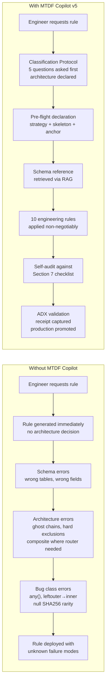
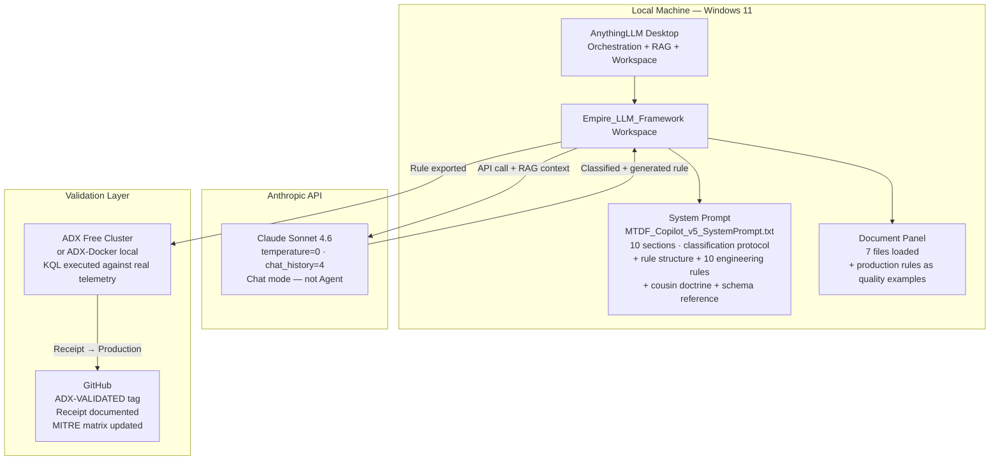
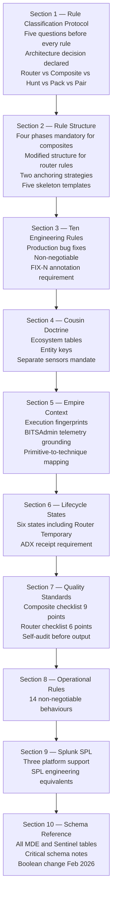
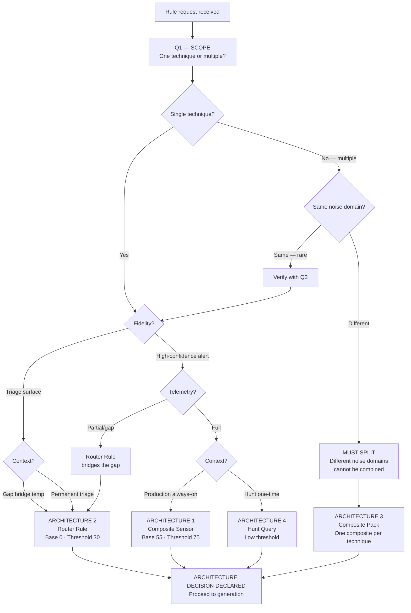
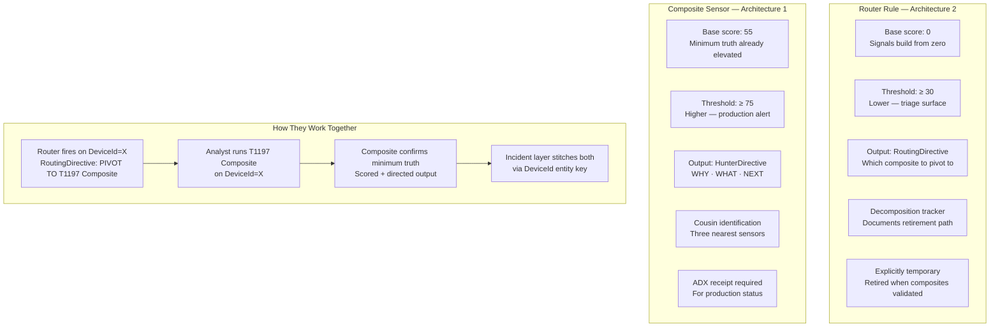
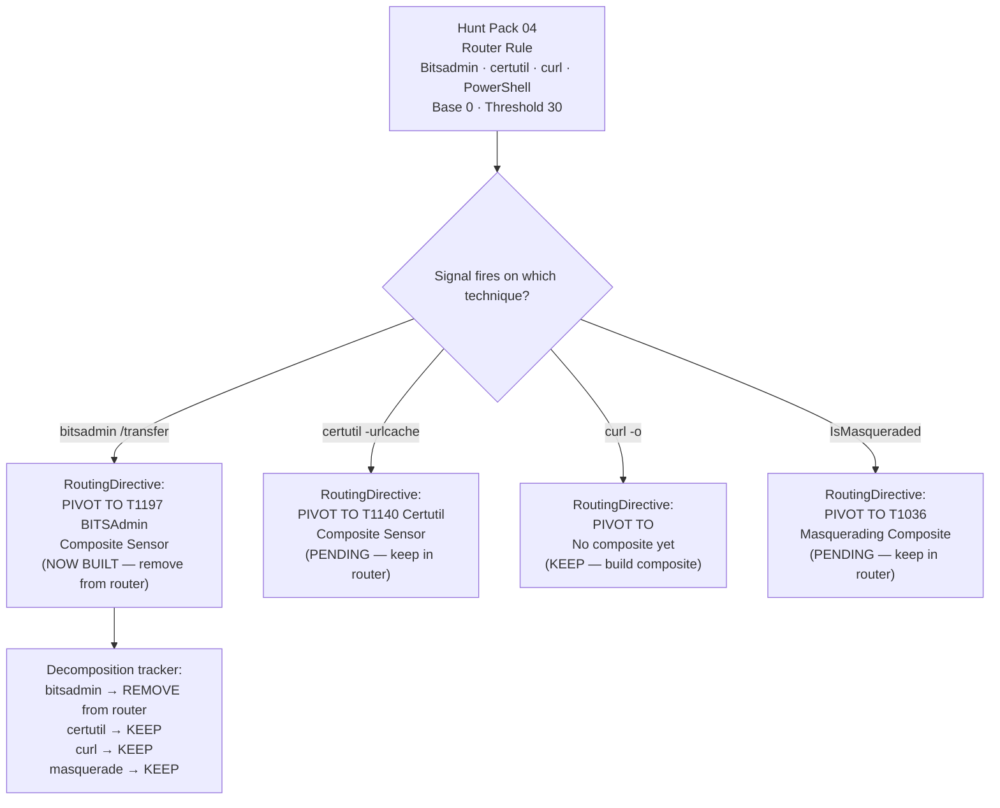
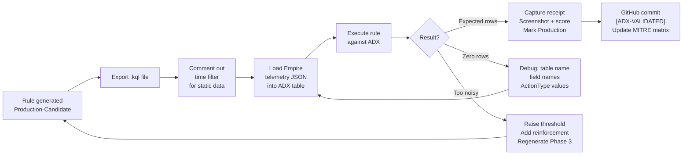
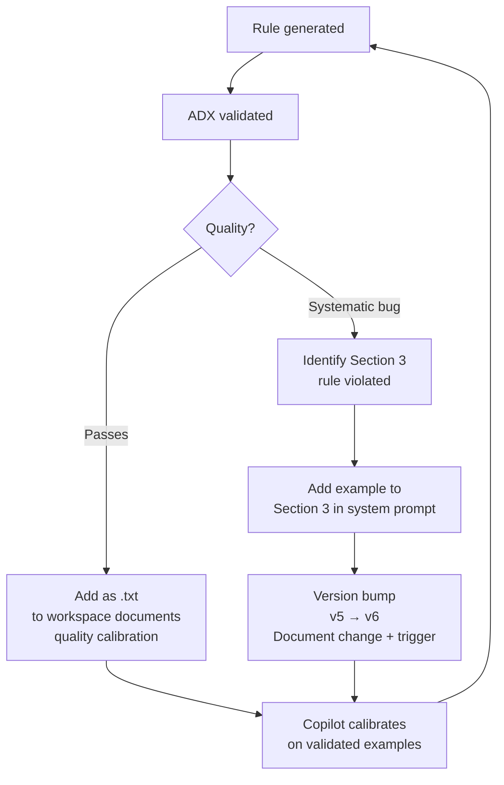
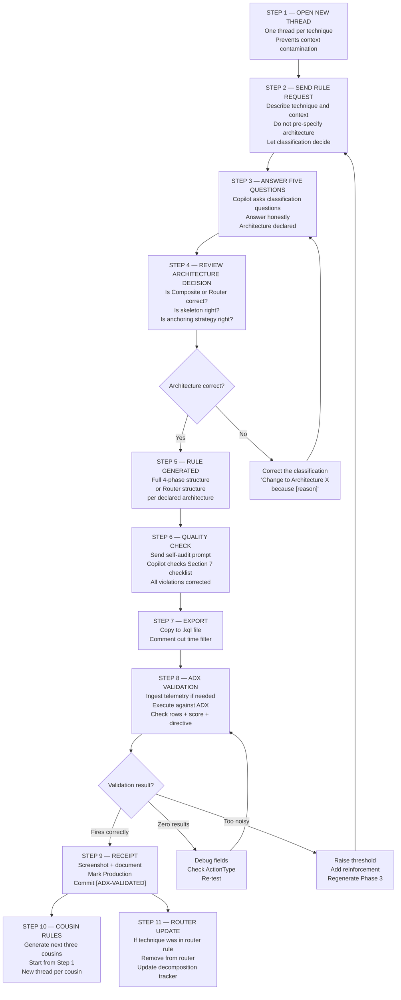

# MTDF AI Copilot — R&D Master Document
### Agentic Detection Engineering Pipeline: Architecture, Implementation, Rule Classification & Operational Guide

**Author:** Ala Dabat | 2026  
**Repository:** [azdabat/Empire-LLM-Framework](#) *(link pending)*  
**Framework:** [Minimum Truth Detection Framework](https://github.com/azdabat/Minimum-Truth-Detection-Framework-ADX-Validated-Composite-Rules)  
**License:** [CC BY-NC-SA 4.0](https://creativecommons.org/licenses/by-nc-sa/4.0/legalcode)

---

> *"The Copilot does not replace the detection engineer.*  
> *It accelerates them — enforcing doctrine, preventing implementation bugs,*  
> *classifying rule architecture before generating,*  
> *and producing scaffolds that the engineer validates, calibrates, and commits."*

---

## Table of Contents

- [Part I — The Problem This Solves](#part-i--the-problem-this-solves)
- [Part II — Architecture](#part-ii--architecture)
- [Part III — System Prompt Design (v5)](#part-iii--system-prompt-design-v5)
- [Part IV — The Rule Classification Protocol](#part-iv--the-rule-classification-protocol)
- [Part V — Router Rules vs Composite Sensors](#part-v--router-rules-vs-composite-sensors)
- [Part VI — Workspace Configuration](#part-vi--workspace-configuration)
- [Part VII — The Prompt Engineering Playbook](#part-vii--the-prompt-engineering-playbook)
- [Part VIII — Failure Modes & Correction Prompts](#part-viii--failure-modes--correction-prompts)
- [Part IX — Rule Validation: ADX-Docker](#part-ix--rule-validation-adx-docker)
- [Part X — ADX Validation: Step-by-Step](#part-x--adx-validation-step-by-step)
- [Part XI — Incremental Fine-Tuning](#part-xi--incremental-fine-tuning)
- [Part XII — The Full Workflow](#part-xii--the-full-workflow)

---

## Part I — The Problem This Solves

Detection engineering at scale requires simultaneous mastery of five domains: schema precision, KQL engine behaviour, detection doctrine, adversary tradecraft, and operational constraints. Without tooling, even experienced engineers produce rules with systematic failure modes — rules that are logically correct but technically flawed, or architecturally wrong for their operational purpose.

The MTDF Copilot solves this by being a **doctrine-enforcement and classification engine**, not a code generator. It forces the right questions before generating a single line of KQL, and enforces the framework's ten production engineering rules non-negotiably throughout generation.



---

## Part II — Architecture

### Stack Overview



### Why These Choices

| Component | Role | Why |
|-----------|------|-----|
| AnythingLLM | Orchestration + RAG | Local — Empire telemetry never leaves machine |
| Claude Sonnet 4.6 | LLM engine | Best instruction-following at temperature=0 |
| temperature=0 | Deterministic output | Rules must be reproducible |
| chat_history=4 | Short context | Prevents context poisoning across rules |
| Chat mode | Direct generation | Agent mode introduces instability |
| RAG documents | Schema + skeleton retrieval | Keeps system prompt lean |
| Empire telemetry JSON | Real attack grounding | Rules anchored to real signals |

### Why Ollama Was Abandoned

| Issue | Impact |
|-------|--------|
| Model unloading mid-generation | Incomplete rules, silent failure |
| 4b parameter instruction forgetting | Doctrine ignored after 2 exchanges |
| Schema hallucination | Wrong field names, wrong tables |
| Context exhaustion on long rules | Truncated output, missing phases |

---

## Part III — System Prompt Design (v5)

The v5 system prompt has ten sections. The critical new addition is Section 1 — the Rule Classification Protocol, which was absent in v4 and is the primary driver of output quality improvement.



### v4 vs v5 — What Changed

| Element | v4 | v5 |
|---------|----|----|
| Rule classification | Not present | Section 1 — five questions mandatory |
| Router rule doctrine | Not present | Full architecture with base=0, threshold=30 |
| Architecture decision | Engineer decides implicitly | Copilot declares explicitly before KQL |
| Router template | Not present | Full template with decomposition tracker |
| Quality standards | Composite only | Composite checklist + Router checklist |
| Operational rules | 12 rules | 14 rules including session management |
| Schema placement | Section 2 | Section 10 (after doctrine sections) |

---

## Part IV — The Rule Classification Protocol

The classification protocol is the most important addition in v5. It prevents the most common architectural error: generating a composite sensor when a router rule is needed, or a router rule when a composite is needed.



### The Five Questions — With Explanations

**Q1 — SCOPE:** Determines whether we are dealing with a single clean anchor or a technique family requiring multiple sensors.

**Q2 — NOISE DOMAIN:** The most architecturally critical question. Combining techniques with different noise domains creates rules that cannot be suppressed without blind spots. The ingress tool transfer example illustrates this perfectly — bitsadmin.exe (SCCM context), certutil.exe (developer context), and curl.exe (DevOps context) have completely different legitimate use profiles and require different suppression logic.

**Q3 — FIDELITY:** Determines the output quality bar. High-confidence alerts demand composite sensors with base 55 and threshold 75. Triage surfaces use router rules with base 0 and threshold 30.

**Q4 — TELEMETRY:** Determines whether composite generation is viable right now. Missing telemetry = router rule bridges the gap.

**Q5 — CONTEXT:** Determines the operational deployment model and associated engineering requirements.

---

## Part V — Router Rules vs Composite Sensors

This is the architectural distinction that the v4 system prompt lacked entirely. Understanding when each is appropriate is foundational to producing a coherent detection estate.



### The Ingress Tool Transfer Case Study

Your Hunt Pack 04 is the canonical example of a valid router rule:



### When Router Rules Are Valid

| Condition | Valid? | Reason |
|-----------|--------|--------|
| Multiple techniques, different noise domains, no composites yet | ✅ Valid | Classic gap-bridging router |
| Multiple techniques, same noise domain | ❌ Invalid | Combine in composite pack |
| Technique has validated composite | ❌ Invalid | Remove from router, use composite |
| High-confidence SOC alert required | ❌ Invalid | Composite only |
| Permanently replacing composite engineering | ❌ Invalid | Router is debt, not architecture |

### Scoring Architecture Differences

```kql
// ROUTER RULE — base starts at ZERO
// Every signal builds from nothing — analyst must see convergence to act
| extend RawScore = 0
    + iff(IsMasqueraded == 1,    50, 0)  // Renamed binary — strong signal
    + iff(HasRemoteURL == 1,     20, 0)  // External download
    + iff(IsShellParent == 1,    15, 0)  // Shell parent
    + iff(IsDangerousExt == 1,   10, 0)  // Executable drop
| extend RiskScore = iif(RawScore < 0, 0, RawScore)
| where RiskScore >= 30  // LOW THRESHOLD — triage surface

// COMPOSITE SENSOR — base starts at 55
// Minimum truth already elevates confidence — reinforcement amplifies
| extend RawScore = 55            // Base: /transfer + remote URL = structural truth
    + iff(IsHighRiskDomain == 1, 15, 0)
    + iff(IsUserWritableDrop == 1, 10, 0)
    + iff(IsShellParent == 1,    10, 0)
| extend RiskScore = iif(RawScore < 0, 0, RawScore)
| where RiskScore >= 75  // HIGH THRESHOLD — production alert
```

---

## Part VI — Workspace Configuration

### Current State

```
Empire_LLM_Framework
├── System Prompt: MTDF_Copilot_v5_SystemPrompt.txt
├── Model: Claude Sonnet 4.6
├── Mode: Chat (NOT Agent, NOT Query)
├── History: 4
└── Documents (7 loaded):
    ├── cmd_bitsadmin_download_psh_script...json  ← Empire telemetry
    ├── MTDF_Schema_Complete_Reference.txt
    ├── MTDF_Schema_MDE.txt
    ├── MTDF_Schema_Sentinel.txt
    ├── MTDF_Skeleton_A_SubstrateFirst.txt
    ├── MTDF_Skeleton_B_IntentFirst.txt
    └── MTDF_Skeleton_C_Sentinel.txt
```

### Documents to Add

```
Priority additions:
├── 01_lsass_process_access.json       ← Primary LSASS signal
├── 02_process_create_rundll32.json    ← rundll32 signal
├── 04_file_create.json                ← File staging signal
├── 06_network_events.json             ← C2 network signal
├── T1197_BITSAdmin_PRODUCTION.txt     ← Validated composite (quality example)
└── T1003001_LSASS_PRODUCTION.txt      ← Validated composite (quality example)
```

---

## Part VII — The Prompt Engineering Playbook

### Reusable Templates

#### TEMPLATE A — Intent-First Composite

```
Generate a production-candidate composite rule for [T####.###]
[technique name].

Intent-First. Skeleton B. MDE Advanced Hunting.

Empire telemetry reference: [filename] contains the primary signal —
[describe the signal in one sentence].

Minimum truth: [state the irreducible anchor explicitly].

Cover these execution paths:
- [path 1]
- [path 2 — alternate form]

Include: pre-flight declaration, inline commentary, scoring decision
table, minimum fire path arithmetic, three cousin sensors, all ten
engineering rules from Section 3.
```

#### TEMPLATE B — Substrate-First Composite

```
Generate a production-candidate composite rule for [T####.###]
[technique name] — [fileless / kernel-level / no-child-process] variant.

Substrate-First. Skeleton A. MDE Advanced Hunting.

CONSTRAINT: There is NO child process. NO command-line argument.
The substrate IS the signal. Do NOT use DeviceProcessEvents.
Table: [DeviceImageLoadEvents / DeviceEvents / DeviceFileEvents].

Minimum truth: [state the substrate existence condition].

Include: pre-flight declaration, inline commentary, scoring decision
table, minimum fire path arithmetic, three cousin sensors, all ten
engineering rules applied.
```

#### TEMPLATE C — Router Rule

```
Generate a Router Rule for [technique family name].
Architecture: Router Rule (Architecture 2).
This is a triage surface — NOT a production alert.

Techniques to cover:
- [technique 1] — [why no composite yet]
- [technique 2] — [why no composite yet]

Base score MUST be 0. Threshold MUST be <= 30.
Include RoutingDirective per signal type.
Include decomposition tracker table.
Label clearly: ROUTER RULE — TEMPORARY.
```

#### TEMPLATE D — Full Empire Kill Chain Pack

```
Generate the complete Empire C2 kill chain as a Composite Pack
(Architecture 3). Each rule is a separate independent sensor.
MDE Advanced Hunting. All ten engineering rules throughout.

Pre-flight before each rule. Three cousins after each rule.

RULE 1: T1059.001 — PowerShell Stager
Intent-First · Skeleton B · DeviceProcessEvents
Signal: -NoP -sta -NonI -W Hidden -Enc + IEX + AMSI bypass + VirtualAlloc

RULE 2: T1071.001 — HTTPS C2 Beacon
Intent-First · Skeleton B · DeviceNetworkEvents
Signal: low-volume HTTPS · first-seen domain · jitter · /admin/get.php

RULE 3: T1547.001 — Registry Run Key Persistence
Intent-First · Skeleton B · DeviceRegistryEvents
Signal: RegistryValueSet under \Run with PowerShell payload

RULE 4: T1053.005 — TaskCache Silent Persistence
Substrate-First · Skeleton A · DeviceRegistryEvents
Signal: TaskCache write WITHOUT schtasks.exe — no CLI artefact

RULE 5: T1197 — BITSAdmin Download
Intent-First · Skeleton B · DeviceProcessEvents
Telemetry: cmd_bitsadmin_download document
Signal: /transfer + remote URL · /priority Foreground · AppData drop
Note: svchost.exe owns the network connection, not bitsadmin.exe

RULE 6: T1003.001 — LSASS via comsvcs MiniDump
Intent-First · Skeleton B · DeviceEvents
Signal: MiniDump named export AND ordinal #24 form

RULE 7: T1021.002 — SMB Lateral Movement
Intent-First · Skeleton B · DeviceProcessEvents
Signal: services.exe spawning uncommon child binary

RULE 8: T1021.003 — WMI Remote Execution
Substrate-First · Skeleton A · DeviceProcessEvents
Signal: WmiPrvSE.exe spawning cmd.exe or powershell.exe

RULE 9: T1546.003 — WMI Fileless Persistence
Substrate-First · Skeleton A · DeviceImageLoadEvents
Signal: scrcons.exe loading vbscript.dll / jscript.dll / scrobj.dll
CRITICAL: NO child process. DeviceImageLoadEvents ONLY.
```

### The Quality Check Prompt (send after every rule)

```
Self-audit the rule you just generated against the Section 7
quality standards checklist. Check every item explicitly:

For Composite Sensors:
□ Pre-flight — all five fields present?
□ Correct table for this technique?
□ Phase 1 minimum truth only — no joins?
□ Phase 2 InitiatingProcess* native fields only?
□ Rule 1: arg_max not any()
□ Rule 2: make_set_if not make_set(iff(...))
□ Rule 3: substring length-guarded
□ Rule 4: prevalence window ends before detection window
□ Rule 5: isnotempty(SHA256) on rarity conditions
□ Rule 6: leftouter — extend IsMatch before filtering
□ Rule 7: iff(flag == 1, ...) not iff(flag, ...)
□ Rule 8: toint() on all boolean flags
□ Rule 9: score floor for critical signals
□ Rule 10: iif(RiskScore < 0, 0, RiskScore)
□ Scoring decision table present?
□ Minimum fire path arithmetic documented?
□ HunterDirective BEFORE project statement?
□ Three cousin rules identified?
□ Lifecycle state in header?

For Router Rules:
□ Base score = 0?
□ Threshold <= 30?
□ RoutingDirective per signal type?
□ Decomposition tracker present?
□ Labelled ROUTER RULE — TEMPORARY?

Flag every violation. Correct all violations in place.
```

---

## Part VIII — Failure Modes & Correction Prompts

### The Eight Common Failure Modes

| Failure | Symptom | Rule Violated | Correction Prompt |
|---------|---------|--------------|-------------------|
| Wrong table | Fileless WMI rule uses DeviceProcessEvents | Doctrine | "No child process — switch to DeviceImageLoadEvents" |
| Router base 55 | Router rule starts at 55 not 0 | Section 1 | "Router base MUST be 0 — reset and recalculate" |
| Ghost chain | join kind=inner makes reinforcement mandatory | Rule 6 | "Change inner to leftouter, extend IsMatch" |
| any() non-determinism | Multiple any() in summarise | Rule 1 | "Replace with arg_max(Timestamp, *)" |
| Hard exclusion | where FileName != "ccmexec.exe" | Doctrine | "Replace with soft down-score penalty" |
| HunterDirective after project | Missing from output | Additional rules | "Move extend before project, add to project list" |
| Null SHA256 rarity | Rarity fires on cmd.exe | Rule 5 | "Add isnotempty(SHA256) guard" |
| Prevalence overlap | Baseline includes detection window | Rule 4 | "Add and Timestamp < ago(7d)" |

### Detailed Correction Prompts

**For Router Rule base score error:**
```
The router rule base score is 55 — this is wrong.
Router rules MUST start at base 0. The 55 base score is for
composite sensors only, where minimum truth already establishes
elevated confidence. In a router rule, no minimum truth is
established — the signals build the case from zero.
Reset base to 0, recalculate all fire paths, lower threshold to 30.
```

**For architecture mismatch:**
```
This rule was generated as a composite but covers multiple techniques
with different noise domains. Apply the classification protocol:
bitsadmin.exe and certutil.exe have different enterprise noise profiles.
Split into:
1. A router rule covering all techniques (base 0, threshold 30)
2. A composite sensor for bitsadmin /transfer only (base 55, threshold 75)
Generate the router rule first with decomposition tracker.
```

---

## Part IX — Rule Validation: ADX-Docker

AnythingLLM cannot test KQL. It processes telemetry as text for context in generation. It does not execute queries.

**Validation requires ADX.** The workflow:



---

## Part X — ADX Validation: Step-by-Step

### Method A — Azure Free Cluster

1. Go to `dataexplorer.azure.com` → **+ Add cluster** → **Create free cluster**
2. Name: `mtdfvalidation` → Create → **+ Add database** → `empire_telemetry`
3. Create tables matching MDE schema (see table commands below)
4. Ingest telemetry: **Ingest data** → From local file → select JSON → map fields
5. Comment out `| where Timestamp > ago(Xd)` in generated rule
6. Execute → capture screenshot of query + results + RiskScore column
7. Update rule header: `// STATUS: Production (ADX validated YYYY-MM-DD)`
8. Commit to GitHub with `[ADX-VALIDATED]` in commit message

### Method B — Local Docker

```powershell
docker pull mcr.microsoft.com/azuredataexplorer/kustainer:latest
docker run -d --name mtdf-adx -p 8080:8080 `
    mcr.microsoft.com/azuredataexplorer/kustainer:latest
```
Connect via `dataexplorer.azure.com` → Add cluster → `http://localhost:8080`
Then follow Method A from step 3.

### Table Creation Commands

```kql
.create table DeviceProcessEvents (
    Timestamp: datetime, DeviceId: string, DeviceName: string,
    ActionType: string, FileName: string, FolderPath: string,
    SHA256: string, ProcessId: long, ProcessCommandLine: string,
    AccountName: string, AccountDomain: string,
    InitiatingProcessFileName: string,
    InitiatingProcessCommandLine: string,
    InitiatingProcessSHA256: string, InitiatingProcessId: long,
    InitiatingProcessSignerType: string,
    InitiatingProcessIntegrityLevel: string,
    InitiatingProcessAccountName: string
)
```

```kql
.create table DeviceEvents (
    Timestamp: datetime, DeviceId: string, DeviceName: string,
    ActionType: string, FileName: string, FolderPath: string,
    SHA256: string, InitiatingProcessFileName: string,
    InitiatingProcessSHA256: string,
    InitiatingProcessCommandLine: string,
    InitiatingProcessAccountName: string,
    AdditionalFields: dynamic
)
```

### Telemetry → Table Mapping

| File | Table |
|------|-------|
| `cmd_bitsadmin_download...json` | `DeviceProcessEvents` |
| `01_lsass_process_access.json` | `DeviceEvents` |
| `02_process_create_rundll32.json` | `DeviceProcessEvents` |
| `04_file_create.json` | `DeviceFileEvents` |
| `06_network_events.json` | `DeviceNetworkEvents` |

---

## Part XI — Incremental Fine-Tuning



### Version History

| Version | Key Addition | Trigger |
|---------|-------------|---------|
| v1 | Basic structure | First generation |
| v2 | Schema reference | Hallucination errors |
| v3 | 10 engineering rules | Production bug review |
| v4 | Cousin doctrine, Empire context, Splunk | Quality review |
| v5 | Classification protocol, Router doctrine | Ingress tool transfer case study |
| v6 | *(next)* Validated rule calibration examples | First ADX receipt batch |

---

## Part XII — The Full Workflow



---

> [!NOTE]
> This document covers MTDF Copilot v5 — the first version with classification protocol
> and formal router rule doctrine. System prompt: 10 sections, 599 lines.

> [!IMPORTANT]
> **Never start at base 55 in a router rule.**
> **Never start at base 0 in a composite sensor.**
> These are the two most architecturally significant rules in the framework.
> Violating either produces a rule that is either untuneable (router at 55)
> or meaningless as a production alert (composite at 0).

---

*Author: Ala Dabat | [github.com/azdabat](https://github.com/azdabat)*  
*Licensed under [CC BY-NC-SA 4.0](https://creativecommons.org/licenses/by-nc-sa/4.0/legalcode)*
