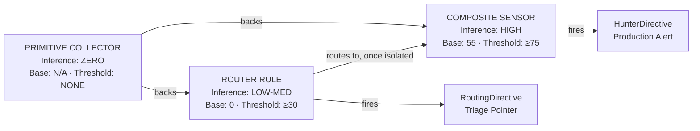
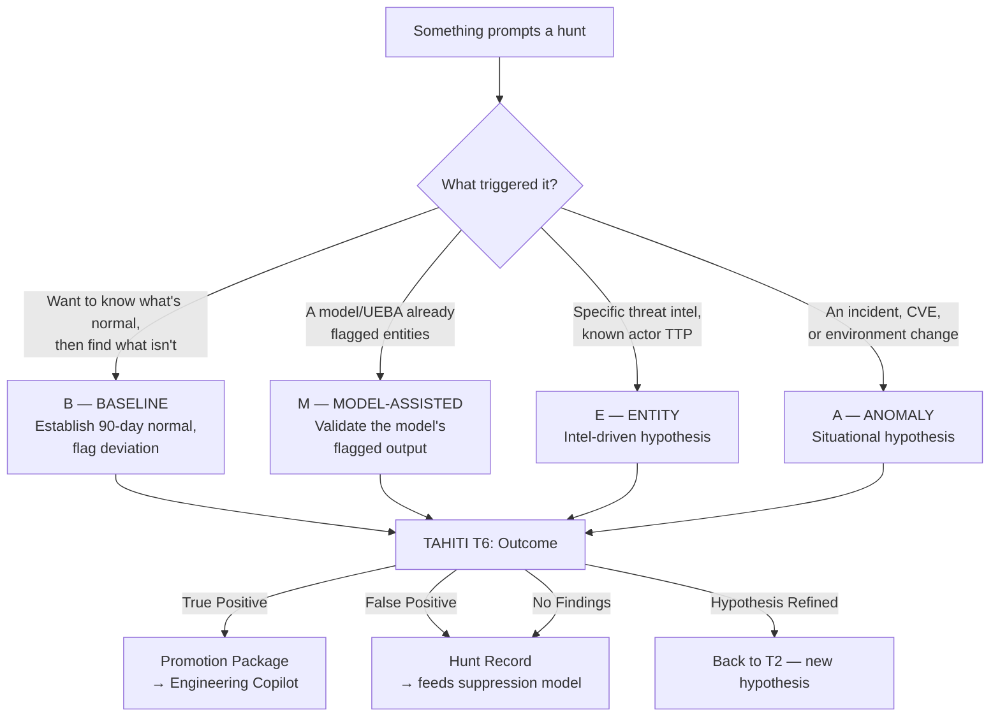
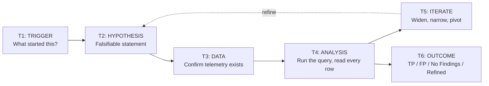
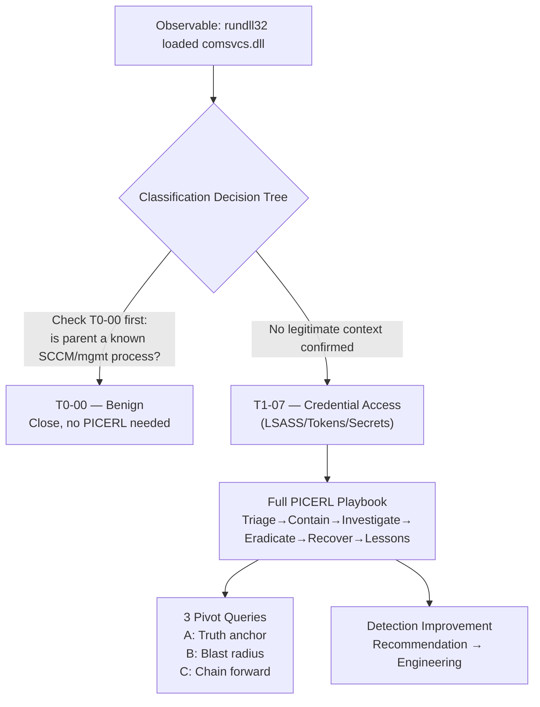
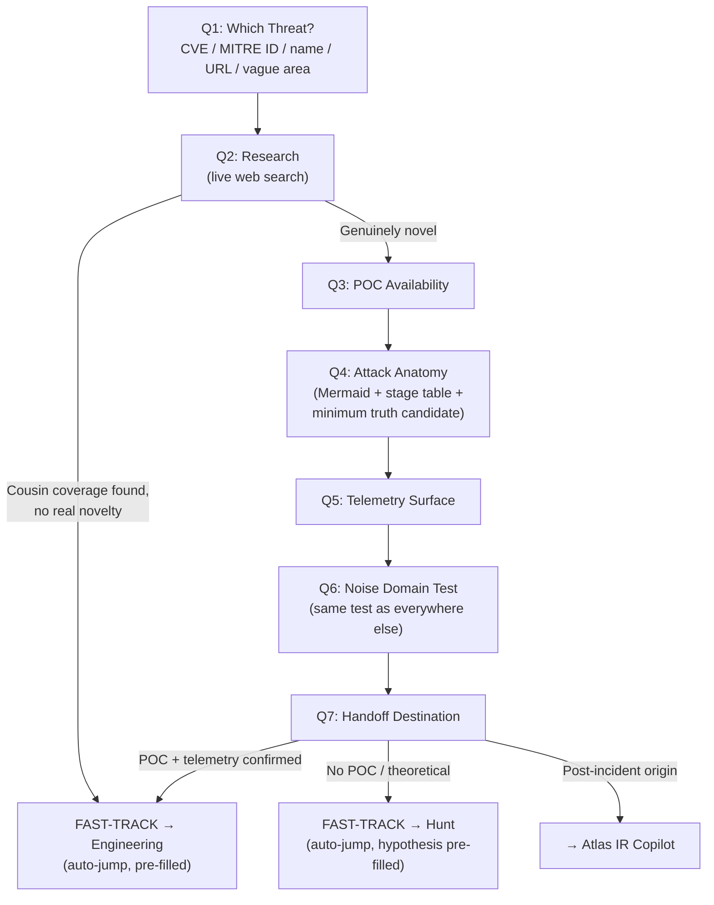
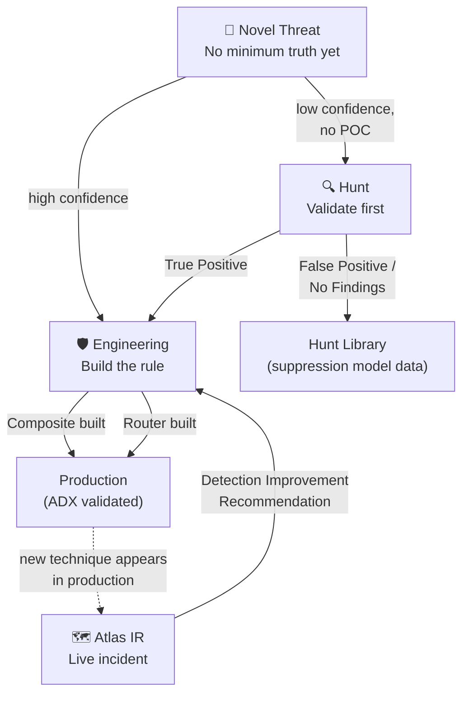

# The Minimum Truth Detection Framework (MTDF)
### A Complete Reference: Doctrine, Decisions, and the AI Copilot Suite

*Created by Ala Dabat | 2026*

---

## How to use this document

This is the reference for everything built so far: the doctrine itself, *why* each decision in the doctrine exists, annotated KQL showing the doctrine in actual code, and how the four AI Copilot tabs (Detection Engineering, Threat Hunt, Atlas IR, Novel Threat) implement and connect to it.

If you're a hybrid security specialist trying to understand *why* a rule was built the way it was — this document is written to answer that, not just describe what exists.

---

## Part 1 — The Crown Jewel: The Minimum Truth Doctrine

### What "minimum truth" actually means

Every detection rule, no matter how sophisticated, is ultimately a claim: *"this telemetry means an attacker did something."* The danger in detection engineering is making that claim with more confidence than the evidence actually supports — what MTDF calls **ghost chains**: rules that look rigorous but are actually stitched together from independent, weakly-correlated signals that *feel* like proof but aren't.

The Minimum Truth doctrine exists to prevent this. Its core instruction:

> **Start with the minimum truth required for the attack to exist. Everything else is reinforcement — not dependency. If the baseline truth is not met, the attack is not real.**

In practice, this means before writing a single line of KQL, you must be able to state — in plain language, with zero inference — the one irreducible thing that has to be true for this technique to have occurred. Not "this looks suspicious." Not "this is unusual." The literal, structural fact.

**Example of doing this wrong:**
> "PowerShell executed with unusual flags, contacted a rare external IP, and downloaded a file — this is probably C2."

That's three independent observations stacked together to *imply* certainty none of them individually proves. This is a ghost chain.

**Example of doing this right:**
> "Minimum truth: `powershell.exe` executed with an `-EncodedCommand` flag containing a base64-encoded payload over 400 characters long. That fact alone — regardless of what happens next — is the anchor. Everything else (rare IP, file download) is reinforcement that increases confidence, not a precondition for the rule to mean something."

### Why this is the crown jewel, not just a nice idea

Every other piece of MTDF — the three-layer spectrum, the noise-domain test, the four-phase rule structure — exists *to operationalize* this one idea. The three layers are minimum truth at three different depths of inference. The noise-domain test decides how to *protect* the minimum truth from false positives without diluting it. The four-phase structure is the actual code pattern that keeps minimum truth, reinforcement, and noise-suppression from getting tangled together inside a single mess of `where` clauses.

If you remember nothing else from this document, remember this: **every question MTDF asks you, in every tab, is in service of finding and protecting one true sentence.**

---

## Part 2 — The Three-Layer Inference Spectrum

MTDF doesn't treat "detection rule" as one undifferentiated thing. It recognizes that detection content lives at three distinct depths of inference, and conflating them is one of the most common — and most damaging — mistakes in detection engineering.



### Layer 1 — Primitive Collector

**What it is:** An atomic, zero-inference index of a substrate event. It makes no claim about intent or malice — it simply records that something happened.

**When to use it:** Any time you want a permanent, silent, 30-day rolling record of an event type that *might* matter later — even if you can't yet articulate the attack it belongs to. Primitives exist so that when you finally build a Composite six months from now, you have 30 days of backing history to validate against immediately, instead of starting your detection's life with zero historical context.

**How it's built:**
- No scoring, no threshold, no `summarize`, no `arg_max` — every single row is preserved, because the entire value of a primitive is the unfiltered timeline.
- Fixed 30-day lookback (not 7d like Router/Composite) since its job is long-horizon indexing, not short-horizon alerting.
- Output is a flat indexed fact: timestamp, entity keys, the substrate fields. Nothing else.

**Why this matters:** The temptation when building a primitive is to sneak in "just one small filter" — excluding what looks like obvious noise. MTDF doctrine forbids this explicitly, because the moment you filter, you've made an inference, and the primitive is no longer zero-inference. A composite built later, querying back against a *filtered* primitive, will have silently lost the very rows it needed.

**Annotated example — PowerShell Primitive (from your own build):**

```kql
// Architecture: Primitive Collector (Layer 1 — Inference: ZERO)
// Claim being made: "PowerShell executed on this device" — nothing more.

let lookback = 30d;
let PowerShellBinaries = dynamic(["powershell.exe", "pwsh.exe"]);

DeviceProcessEvents
| where Timestamp > ago(lookback)
| where tolower(FileName) in (PowerShellBinaries)
    // ^ NOTE: no filter on flags, arguments, or parent process here.
    //   -Enc, -EP Bypass, IEX, abbreviated flags — ALL preserved.
    //   That filtering is the COMPOSITE's job, not the primitive's.
| project
    Timestamp, DeviceId, DeviceName, AccountName,
    ProcessCommandLine,   // full command line, unfiltered — the composite
                          // queries specific flags out of THIS field later
    FileName, SHA256, ProcessId,
    InitiatingProcessFileName, InitiatingProcessCommandLine
| sort by Timestamp asc
    // ^ ascending, not descending — primitives reconstruct a TIMELINE,
    //   they are not a "most recent first" alert feed.
```

The annotation that matters most here: **no `summarize`, no `arg_max`.** Every execution of PowerShell on every device gets its own row, forever (within the 30-day window). High volume is not a bug at this layer — it's the entire point.

---

### Layer 2 — Router Rule

**What it is:** A triage surface covering *multiple* techniques that share a goal but **don't share a noise profile.** Low base score (0), low threshold (≥30), temporary by design.

**When to use it — the single deciding question:**

> *Can ONE suppression model cover every technique in scope without creating a blind spot in any of them?*

If the answer is **no**, you need a Router Rule. This is the most important decision point in the entire framework, and it's worth walking through *why* precisely:

A suppression model is just an allowlist of "things to forgive" — service accounts, management tooling, legitimate developer activity. The danger is that the things you must forgive for Technique A are often *exactly* the things that look suspicious for Technique B. If `bitsadmin.exe` gets a blanket SCCM-noise exemption, and `certutil.exe` gets caught in that same exemption because they were combined into one rule, you've just blinded yourself to certutil misuse — a completely different tool with a completely different legitimate-use profile.

**Worked example, from your own LOLBin Router Rule:**
> Bitsadmin's legitimate noise comes from SCCM, Intune, Windows Update. Certutil's legitimate noise comes from PKI teams and dev certificate tooling. Curl's legitimate noise comes from DevOps pipelines. **None of these three noise profiles overlap.** A single suppression list broad enough to cover all three would either (a) be so broad it starts forgiving genuine attacker behavior, or (b) fail to actually suppress any one technique's noise properly because the engineer was trying to keep it narrow enough not to blind the others.

**How it's built — the four-phase structure (no scoring at Phase 1):**

```kql
// PHASE 1: BROAD SURFACE FILTER — cast wide, no minimum truth required yet
DeviceProcessEvents
| where Timestamp > ago(7d)
| where FileName in~ (LOLBins)
| where ProcessCommandLine has_any (AllIndicatorSets)

// PHASE 2: SIGNAL ENRICHMENT — tag which technique fired, tag context
| extend
    IsLSASS    = toint(ProcessCommandLine has_any (Ind_LSASS) and FileName =~ "rundll32.exe"),
    IsAMSI     = toint(ProcessCommandLine has_any (Ind_AMSI)),
    IsManagedAcct = toint(tolower(AccountName) has_any (ManagedAccounts))

// PHASE 3: ROUTING SCORE — base 0, ALWAYS, never 55
| extend RawScore = 0
    + iff(IsLSASS == 1, 40, 0)      // strong per-technique signal
    + iff(IsAMSI == 1, 35, 0)
    - iff(IsManagedAcct == 1, 15, 0) // SOFT penalty — never hard-exclude
| extend RiskScore = iif(RawScore < 0, 0, RawScore)
| where RiskScore >= 30   // ROUTER threshold — never 75, that's Composite's bar

// PHASE 4: ROUTING DIRECTIVE — names the SPECIFIC composite to pivot to
| extend RoutingDirective = case(
    IsLSASS == 1, "CRITICAL → T1003.001 LSASS Dump Composite | Composite pending",
    IsAMSI == 1,  "HIGH → T1562.002 AMSI Bypass Composite | Composite pending",
    "MEDIUM → Identify technique and route to composite"
)
```

**The annotation that matters most:** `RoutingDirective` is a **static string written by the engineer at build time** — it has no live awareness of whether the named composite actually exists yet. It's a hand-authored map of *your current knowledge of the ecosystem*, frozen into a `case()` statement. When you later build the LSASS composite, nothing automatically updates that string from "Composite pending" to "Composite built — run it" — that's a manual maintenance step the **decomposition tracker** exists to remind you of.

**Why Router Rules feel like Threat Hunt rules (and the precise difference):**

This is worth being explicit about, because the line genuinely is thin. Strip the threshold off a Router Rule and run it manually once, reading every row yourself — that *is* a Hunt query. The only real difference is **lifecycle position, not KQL shape**: a Hunt is the investigation that happens *before* a permanent rule exists; a Router Rule is what a Hunt's confirmed *multi-technique* finding becomes the moment you decide to stop investigating manually and start watching automatically, forever, with a machine doing the triage instead of a human reading every row.

---

### Layer 3 — Composite Sensor

**What it is:** A high-confidence, single-technique, single-noise-domain production alert. Base score 55 (always), threshold ≥75 (always), permanent once ADX-validated.

**When to use it — the same deciding question, opposite answer:**
If one suppression model genuinely *can* cover the full technique without creating a blind spot, build a Composite, not a Router Rule.

**The two anchoring strategies — and how to tell which one you need:**

| | Substrate-First | Intent-First |
|---|---|---|
| **The test** | Would this event, with zero malicious flag, still be meaningful? | Is the binary so ubiquitous that its mere execution is noise? |
| **Example** | `scrcons.exe` loading `vbscript.dll` — the DLL load itself *is* the truth | `powershell.exe` alone is noise; `-Enc` is the anchor |
| **Skeleton** | A (MDE) / C (Sentinel) | B (MDE) |
| **Anchor lives in** | The existence of the event | A specific flag/parameter within the event |

**Annotated example — Intent-First Composite (NodeJS RCE, from your own build):**

```kql
// PHASE 1: MINIMUM TRUTH
// WHY: node.exe alone is noise (every web app runs it).
// The minimum truth is node.exe SPAWNING a dangerous child process.
DeviceProcessEvents
| where Timestamp > ago(7d)
| where InitiatingProcessFileName in~ ("node", "node.exe")
| where FileName in~ ("bash","sh","powershell.exe","curl",...)
    // ^ this is the anchor: node->shell is structurally meaningful
    //   on its own, even with zero other signals present

// PHASE 2: NATIVE ENRICHMENT — reinforcement, never a precondition
| extend
    HasDevTcp      = toint(ProcessCommandLine has "/dev/tcp"),
    HasRemoteURL   = toint(ProcessCommandLine matches regex @"https?://"),
    IsBuildServer  = toint(InitiatingProcessFolderPath has_any (CIPaths))

// PHASE 3: CONVERGENCE SCORING — base 55 because minimum truth ALONE
// already earns meaningful confidence; reinforcement adds, never multiplies
| extend RawScore = 55
    + iff(HasDevTcp == 1, 30, 0)     // near-certain malicious reinforcement
    + iff(HasRemoteURL == 1, 20, 0)
    - iff(IsBuildServer == 1, 25, 0) // soft penalty, CI/CD legitimately spawns shells
| extend RiskScore = iif(RawScore < 0, 0, RawScore)
| where RiskScore >= 75

// PHASE 4: HUNTER DIRECTIVE — defined BEFORE project, WHY/WHAT/NEXT
| extend HunterDirective = case(
    RiskScore >= 110, "CRITICAL — Isolate device. Pivot DeviceNetworkEvents for C2.",
    RiskScore >= 90,  "HIGH — Review full command line. Check network connections.",
    "MEDIUM — Verify CI/CD context. Escalate if unexpected."
)
```

**The annotation that matters most:** Notice the minimum fire path is explicit and checkable: `Base 55 + HasRemoteURL 20 = 75 ≥ 75 ✓`. Every Composite must show this arithmetic somewhere in its documentation — it's how you (or anyone reviewing the rule later) can verify the rule actually fires the way its author claims it does, without having to trace the whole scoring table by hand.

## Part 3 — Threat Hunting: PEAK, TaHiTI, and Why Hunt Feels Like Router (Because It Is, Almost)

### The honest starting point

If Router Rules and Threat Hunts look similar when you strip away the scoring, that's because **they genuinely are the same underlying activity at two different points in its lifecycle.** This section exists to make that connection explicit instead of leaving you to feel confused about it.

> **The one-sentence answer:** A Hunt is the investigation that happens *before* a permanent detection exists. A Router Rule or Composite is what that investigation's *confirmed finding* becomes, the moment a human decides to stop reading every row personally and let a machine watch automatically, forever.

### PEAK — what it actually classifies

PEAK ("Prepare, Execute, Act with Knowledge" — originated by Splunk, formalized by SANS) defines **how a hunt gets triggered and how its evidence gets evaluated.** MTDF's Hunt Copilot implements four named types — this was corrected from an earlier version that conflated two of them into one, so the distinction is worth stating precisely:



**B — Baseline.** "What does normal admin access to our domain controllers look like over 90 days, and what falls outside that?" No threat intel required, no model required — just enough history to define normal. **Why this matters specifically:** the baseline you establish here *is* the noise-domain data a later Composite will need — Baseline hunts often produce the cleanest, most defensible suppression models in the whole suite, because you measured "normal" directly instead of guessing at it.

**M — Model-Assisted.** A UEBA platform or trained model has already flagged candidate entities; your job is validation, not initial surfacing. **Why it's separate from Baseline:** the query doesn't compute its own statistics — it starts *from* someone else's model output and pivots into raw telemetry to confirm or refute. It also has a second feedback loop the other three don't: confirmed findings should feed back into tuning the model itself, not just into a new detection rule.

**E — Entity.** You have specific intel — "this APT uses T1078.004" — and you're checking if it's happened here.

**A — Anomaly.** A situational trigger — an incident, a CVE disclosure — prompts you to check for related activity.

### TaHiTI — the six-phase lifecycle every hunt tracks

TaHiTI (Targeted Hunting Integrating Threat Intelligence — originated by the Dutch Payments Association, 2018) defines the *phases* a hunt session moves through, independent of which PEAK type it is.



**A falsifiable hypothesis (T2)** is what separates a real hunt from a fishing expedition. MTDF's required format: *"I hypothesise that [technique] has occurred because [reason], which would be visible as [observable] in [data source]."* If you can't state it this way, your scope is too broad to produce an actionable result.

**The scoping step MTDF added (between T1 and T2):** real-world TaHiTI includes a formal scoping/prioritization phase that this doctrine had initially skipped. It now exists as an explicit question: *does this technique/actor actually target your sector, region, or tech stack, and is it an active campaign or historical?* This produces a Priority Tier (HIGH/MEDIUM/LOW) that shows up in every Hunt Brief — so anyone reviewing a hunt later can see *why it was worth running*, not just what was found.

### Annotated example — the structural difference, shown in code

A Hunt query and a Router Rule, for the same investigation, side by side:

```kql
// HUNT QUERY — Architecture 4 — NO threshold, NO scoring, human reads every row
DeviceProcessEvents
| where Timestamp > ago(14d)    // user-specified window, never fixed
| where InitiatingProcessFileName in~ ("node","node.exe")
| where FileName in~ (DangerousChildren)
| extend HuntSignals = strcat(
    iif(HasDevTcp == 1, "[REVERSE_SHELL] ", ""),
    iif(HasRemoteURL == 1, "[REMOTE_URL] ", "")
)
    // ^ TAGGING, not scoring. No RiskScore. No threshold gate.
    //   The analyst's own judgement is the filter, not a number.
| project Timestamp, DeviceName, ProcessCommandLine, HuntSignals
| sort by Timestamp desc   // most-recent-first: this is an active investigation

// -------- vs --------

// ROUTER RULE — same surface, permanent, machine-watched
...
| extend RiskScore = ...
| where RiskScore >= 30   // <- THIS LINE is the entire difference in kind
| extend RoutingDirective = case(...)
```

**The annotation that matters most:** literally one `| where RiskScore >= N` line is what separates "an analyst is going to read this once" from "a machine is going to watch this forever." Everything else can be — and often is — nearly identical KQL.

---

## Part 4 — Atlas IR Copilot: Classify First, Chase Artefacts Second

**The core doctrine:** *"Classify the ecosystem before you chase the artefact. The artefact changes. The ecosystem does not."*

Atlas exists for live incidents, not investigations-with-no-pressure. Its job is fast: take an observable (a process name, a log line), classify it into one of 22 named ecosystems (12 Tier-1, 10 Tier-2, plus a T0-00 Benign branch), and immediately produce a PICERL playbook and pivot queries — because during a live incident, the cost of getting the classification wrong is measured in minutes, not in a missed detection three weeks later.



**Why T0-00 (Benign) is checked first, always:** false negatives are categorically worse than false positives during live IR — but reflexively classifying everything as malicious wastes response capacity on legitimate SCCM/Intune/PKI activity. Atlas requires *explicit confirmation* of the legitimate context before allowing a T0-00 classification — never an assumption.

**Why Tier-2 incidents get full-depth playbooks, never condensed:** the doctrine explicitly forbids showing a condensed Tier-2 reference during a live investigation — the analyst needs the same PICERL depth regardless of which tier the ecosystem falls in. Condensed Tier-2 entries exist only as a reference library, not as live-incident output.

**The Detection Improvement loop:** every completed Atlas investigation ends with a recommendation back into Engineering — naming the minimum truth anchor, skeleton type, and architecture that *would have* caught this earlier. This is Atlas's version of TaHiTI's Phase 6 ("turn confirmed findings into lasting detection capabilities") — the same principle, applied to incident response instead of proactive hunting.

---

## Part 5 — Novel Threat Copilot: Research Before Hypothesis

**The gap this fills:** Engineering assumes you already know your minimum truth. Hunt assumes you already have a hypothesis. Both assume *something* — a name, a technique, a known shape. Novel Threat exists for when you have a CVE number, a malware name, or just "I read about this" and nothing else. It does the research and anatomy-building that has to happen *before* a hypothesis can even be written.



**Why research happens before the question is shown, not after:** Engineering, Hunt, and Atlas's intake questions work because the user already knows the answers — they're reporting facts. Novel Threat is different: the user often doesn't know the answer until research happens *for* them. So Q2 and Q4 are not static questions — they're "go research, then present findings for confirmation" steps.

**The POC doctrine, stated precisely (this is easy to get backwards):** a working proof-of-concept proves the attack is *achievable* and gives you real telemetry to anchor against. It does **not** decide Router vs Composite — that's still Q6's job, using the identical noise-domain test used everywhere else in the suite. What POC presence actually changes is *evidence quality*: a rule built from observed POC telemetry has exact field values; one built from theoretical reasoning carries explicit ASSUMPTION flags and a stronger recommendation to validate via Hunt before committing to a permanent Composite.

**The six Minimum Truth Skeleton Patterns**, named explicitly at Q4 so novel threats stay anchored to repeatable structure instead of producing a bespoke one-off shape every time:

| Pattern | Shape | Example |
|---|---|---|
| 1. Process Substrate | A load/call is rare or structurally meaningful on its own | `scrcons.exe` loading `vbscript.dll` |
| 2. Command Intent | A ubiquitous binary + a specific flag implies capability | `powershell.exe -Enc` |
| 3. Stage-and-Execute | Co-occurrence of two events is the truth, neither alone | File drop → execution within N minutes |
| 4. Identity/Access Anomaly | An auth/consent event with an anomalous attribute | New-geo + new-ASN sign-in |
| 5. Volumetric/Statistical | No single event is malicious — only deviation reveals it | Recommend Hunt-first, not Composite-first |
| 6. Telemetry Gap | Mechanism understood, no table captures it directly | Recommend Primitive-first — "visibility gap, not a logic gap" |

**The fast-track mechanism — how it actually works, mechanically:** the model can't reach into the application's state directly. It signals a decision with an invisible marker (`[[FASTTRACK:ENGINEERING|...]]` or `[[FASTTRACK:HUNT|...]]`) at the end of its message; the application code watches for that marker, strips it from what you see, and offers a button that — if clicked — writes pre-filled answers directly into Engineering's or Hunt's own intake state and drops you partway through their flow instead of back at question one.

---

## Part 6 — How the Four Tabs Thread Together



Every arrow on this diagram is a **Promotion Package** — a pre-formatted block of answers shaped to skip the destination tab's own intake. Hunt produces one at T6 (True Positive). Novel Threat produces one at Q7. Atlas produces a Detection Improvement Recommendation that does the same job for its own findings. This is deliberate: the framework's real product isn't four separate tools, it's **one continuous pipeline with four entry points**, depending on how much you already know when you start.

---

## Part 7 — Reference Frameworks and Further Reading

MTDF's Hunt doctrine is built directly on top of two real, externally-documented frameworks — not invented terminology:

- **PEAK Threat Hunting Framework** (Splunk / SANS) — [hunt.io/glossary/peak-threat-hunting-framework](https://hunt.io/glossary/peak-threat-hunting-framework)
- **TaHiTI: Targeted Hunting Integrating Threat Intelligence** (Dutch Payments Association, 2018) — [hunt.io/glossary/tahiti-threat-hunting-framework](https://hunt.io/glossary/tahiti-threat-hunting-framework)
- **MITRE ATT&CK** — the technique catalogue every MTDF rule maps against — [attack.mitre.org](https://attack.mitre.org/)
- **Atomic Red Team** — the source of ground-truth test definitions for validating detection content — [github.com/redcanaryco/atomic-red-team](https://github.com/redcanaryco/atomic-red-team)

**A note on provenance, stated plainly:** MTDF does not pull content wholesale from any of these sources. Detection rules built under this framework are original work, reasoned through the doctrine described in this document. Where a rule claims to be grounded in a specific Atomic Red Team test or a specific PEAK/TaHiTI concept, that grounding should be verifiable — not just plausible-sounding.

---

## Part 8 — Live Application Reference

The doctrine in this document is implemented as a four-tab Streamlit application on Hugging Face Spaces:

**[huggingface.co/spaces/ViolentPython/MTDF-Copilot-v6](https://huggingface.co/spaces/ViolentPython/MTDF-Copilot-v6)**

| Tab | Doctrine | Output |
|---|---|---|
| 🛡️ Detection Engineering | This document, Parts 1–2 | Primitive / Router / Composite KQL, phase-by-phase |
| 🔍 Threat Hunt | This document, Part 3 | Architecture 4 Hunt queries, PEAK-classified, TAHITI-tracked |
| 🗺️ Atlas IR Copilot | This document, Part 4 | Ecosystem classification, PICERL playbook, pivot queries |
| 🧪 Novel Threat Copilot | This document, Part 5 | Attack anatomy, minimum truth candidate, Promotion Package |

GitHub repository (rule library, additional reference documents):
**[github.com/azdabat/Minimum-Truth-Detection-Framework-ADX-Validated-Composite-Rules](https://github.com/azdabat/Minimum-Truth-Detection-Framework-ADX-Validated-Composite-Rules)**

---

## Part 9 — Roadmap

Items identified during development that are designed but not yet built, or built but not yet stress-tested at scale:

- **On-demand KQL sanity check** — a second-pass model review of any generated rule, checking for the array/string-matching bug class (dead/redundant `dynamic([...])` entries, character-encoding mismatches like en-dashes vs hyphens, unverified array-index assumptions into JSON fields) plus a *predicted* hit/miss table reasoning through 3-5 known technique variants against the rule's actual logic. Explicitly labeled as a reasoned prediction, not an executed test, since no live telemetry exists in this environment to run against.
- **Attacker-perspective opener** — every tab's first substantive response narrating what the attacker is actually doing, in plain language, before any doctrine machinery starts.
- **Help Me Choose upgrade** — Engineering's 3-question noise-domain test currently lacks the per-question evaluation/pushback treatment the rest of the suite has.
- **Validation pass on the first 10 Atomic-Red-Team-aligned primitives** — an earlier build session generated primitives for the "top 10 Atomic Red Team hunts" from general model knowledge rather than fetching the actual Atomic Red Team repo test definitions. These are believed logically sound (verified by manual audit) but are **not yet grounded in real Atomic test strings** — flagged for a follow-up pass that fetches `redcanaryco/atomic-red-team` directly.
- **Bug found and fixed during the PEAK/TaHiTI rewrite, worth tracking as a pattern:** a positional-index reference (`HUNT_QUESTION_SET[1][1]`) silently broke when a new question was inserted earlier in the list. Fixed by switching to key-based lookup. Worth auditing other parts of the codebase for the same fragile-positional-indexing pattern.
